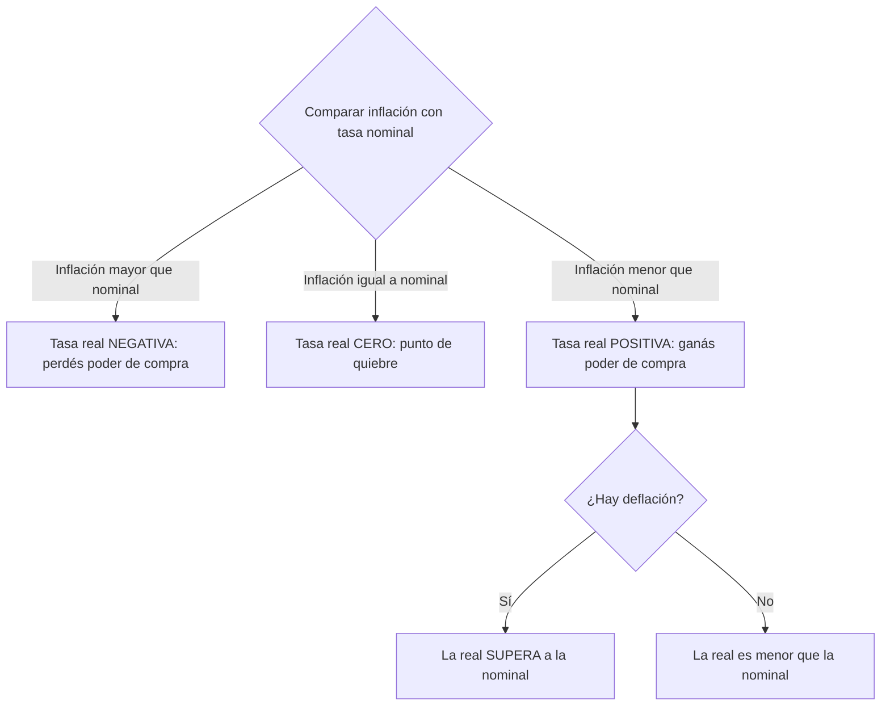

# Ecuación de Fisher

> [!abstract] En una frase
> La tasa que te paga el banco (nominal) no es lo que realmente ganás: hay que
> **dividir** por la inflación para obtener la tasa real, no restarla.

**Prerrequisitos:** [[interes-compuesto]] y [[valor-tiempo-del-dinero]], donde la inflación es uno de los componentes de la tasa.
**Sigue con:** [[tecnicas-de-evaluacion-de-proyectos]], el bloque de indicadores.

---

## El problema que resuelve

Un plazo fijo te paga $20\%$. ¿Ganaste $20\%$? Solo en pesos. Si los precios
subieron $25\%$, podés comprar **menos** cosas que antes. Necesitamos distinguir
dos tasas:

| Tasa | Símbolo | Qué mide |
|---|---|---|
| **Aparente o nominal** | $i_A$ | La que figura en el recibo del banco, sin descontar inflación. |
| **Real** | $i_R$ | Cuánto creció tu **poder de compra**. |
| **Inflación** | $\pi$ | Cuánto subieron los precios en el período. |

## Intuición: contar changuitos, no pesos

> [!example] Analogía: el changuito del supermercado
> Tenés $\$1.000$ y un changuito de supermercado cuesta $\$1.000$: podés comprar
> **1 changuito**.
>
> 1. Invertís al $20\%$ y tenés $\$1.200$ (crecimiento en **pesos**).
> 2. La inflación fue $10\%$: el changuito ahora cuesta $\$1.100$.
> 3. ¿Cuántos changuitos podés comprar? $1.200 / 1.100 = 1{,}0909$.
>
> Tu poder de compra creció $9{,}09\%$, **no** $10\%$. La tasa real se mide en
> changuitos, y para contar changuitos se **divide**, no se resta.

---

## Fórmula

$$
(1 + i_A) = (1 + \pi)\cdot(1 + i_R)
$$

**Por qué es multiplicativa:** crecer en pesos es crecer en changuitos **y
además** en precio del changuito. Dos crecimientos seguidos se combinan
multiplicando factores, igual que en el [[interes-compuesto]].

### Las tres versiones despejadas

$$
i_R = \frac{1 + i_A}{1 + \pi} - 1
\qquad
i_A = (1+\pi)(1+i_R) - 1
\qquad
\pi = \frac{1 + i_A}{1 + i_R} - 1
$$

> [!danger] La resta es solo una aproximación
> $i_R \approx i_A - \pi$ funciona **solo con tasas bajas**:
>
> | Nominal | Inflación | Resta | Fisher (exacto) | Error |
> |---|---|---|---|---|
> | $3\%$ | $1\%$ | $2\%$ | $1{,}98\%$ | Despreciable |
> | $60\%$ | $45\%$ | $15\%$ | $10{,}34\%$ | **Casi 5 puntos** |
>
> Con las tasas argentinas la resta da resultados groseramente mal. En el examen,
> siempre Fisher.

---

## Cómo leer el resultado

## Ejemplos: los tres casos

**Caso base:** nominal $20\%$, inflación $10\%$.

$$
i_R = \frac{1{,}20}{1{,}10} - 1 = 9{,}09\%
$$

**Caso de pérdida:** nominal $20\%$, inflación $25\%$. Tenés $\$1.200$ pero el
changuito cuesta $\$1.250$.

$$
i_R = \frac{1{,}20}{1{,}25} - 1 = -4\%
$$

**Caso de deflación:** nominal $5\%$, $\pi = -2\%$. Los precios **bajan**, así que
cada peso compra más.

$$
i_R = \frac{1{,}05}{0{,}98} - 1 = 7{,}14\%
$$

## Misma nominal, distinta inflación

Con $i_A = 20\%$ fijo:

| Inflación | Tasa real |
|---|---|
| $0\%$ | $20\%$ |
| $10\%$ | $9{,}09\%$ |
| $25\%$ | $-4\%$ |

> [!tip] Punto de quiebre
> La tasa real es exactamente cero cuando $\pi = i_A$. Con una nominal del $22\%$,
> cualquier inflación mayor al $22\%$ vuelve negativa la tasa real.

---

## Errores comunes

| Error | Lo correcto |
|---|---|
| $i_R = i_A - \pi$ | $i_R = \dfrac{1+i_A}{1+\pi} - 1$ |
| Olvidar el $-1$ final. | $1{,}20/1{,}10 = 1{,}0909$ es un **factor**; la tasa es $0{,}0909$. |
| Con deflación, usar $1 + 0{,}02$. | $\pi = -2\%$ da $1 + \pi = 0{,}98$. |
| Pensar que la real nunca supera a la nominal. | Con deflación, la supera. |

---

## Autoevaluación

1. Plazo fijo nominal $60\%$, inflación $45\%$. ¿Ganó o perdió poder de compra?
   > [!question]- Respuesta
   > $i_R = 1{,}60/1{,}45 - 1 = 10{,}34\%$. **Ganó**, aunque bastante menos de lo
   > que sugiere la resta ($15\%$).

2. Nominal $40\%$, real $8\%$. ¿Cuál fue la inflación?
   > [!question]- Respuesta
   > $\pi = 1{,}40/1{,}08 - 1 = 29{,}63\%$.

3. Bono nominal $6\%$ con deflación del $3\%$. ¿Tasa real? ¿Por qué no es $9\%$?
   > [!question]- Respuesta
   > $i_R = 1{,}06/0{,}97 - 1 = 9{,}28\%$. No es la simple diferencia
   > ($6 - (-3) = 9$) porque la relación es multiplicativa: la baja de precios
   > también se aplica sobre los intereses ganados.

4. Querés ganar $5\%$ real y la inflación proyectada es $15\%$. ¿Qué nominal pedís?
   > [!question]- Respuesta
   > $i_A = 1{,}15 \times 1{,}05 - 1 = 20{,}75\%$.

---

## Relacionado

- [[valor-tiempo-del-dinero]]: la inflación como componente de la tasa.
- [[tasa-de-interes]]: la tasa nominal que se descompone acá.
- [[interes-compuesto]]: la misma lógica de factores multiplicados.
- [[ejercicios-interes-e-inflacion]]: A4 a A6 y el repaso de Fisher.
