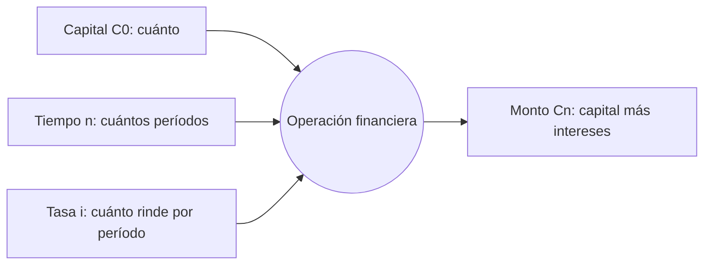

****---
subject: evaluacion-de-proyectos
topic: Interés simple
sources:
  - EPT Clase 2_Matematica Financiera - Parte I.pdf
  - EPT Clase2_ResolucionEjerciciosEnClase.pdf
  - EPT_Clase2_EjerciciosRepaso.pdf
updated: 2026-09-14
tags:
  - evaluacion-de-proyectos/fundamentos
  - formula
  - parcial-1
---

# Interés simple

> [!abstract] En una frase
> En el interés simple los intereses **se retiran** cada período: siempre se
> calculan sobre el mismo capital inicial, así que crecen en línea recta.

**Prerrequisitos:** [[tasa-de-interes]], el precio que se aplica.
**Sigue con:** [[interes-compuesto]], lo que pasa si los intereses no se retiran.

---

## Antes de calcular: los tres elementos

El **interés** es el precio por usar dinero ajeno (o el premio por prestar el
propio). Toda operación financiera tiene tres elementos, y **encontrarlos en el
enunciado es el primer paso**:

---

## Intuición

> [!example] Analogía: los intereses van a un cajón
> Depositás $\$100$ al $10\%$ anual. Cada fin de año el banco te paga $\$10$, vos
> los **sacás y los guardás en un cajón**. El depósito sigue siendo de $\$100$,
> así que el año siguiente te pagan otra vez $\$10$. La plata del cajón no genera
> nada.
>
> - Depósito = capital inicial $C_0$ (nunca cambia)
> - Cajón = intereses acumulados $I$ (crece $\$10$ por año)
> - Depósito + cajón = monto $C_n$

Como cada período suma lo mismo, la relación es **lineal**: si el tiempo se
duplica, el interés también.

---

## Fórmulas

$$
I = C_0 \cdot i \cdot n
\qquad\qquad
C_n = C_0 \cdot (1 + i \cdot n)
$$

| Símbolo | Significado |
|---|---|
| $C_0$ | Capital inicial |
| $i$ | Tasa por período (en decimal: $10\% = 0{,}10$) |
| $n$ | Cantidad de períodos, **en la misma unidad que la tasa** |
| $I$ | Interés total generado |
| $C_n$ | **Monto** o valor futuro: capital más todos los intereses |

**Por qué tiene esta forma:** cada período genera $C_0 \cdot i$, siempre igual.
Después de $n$ períodos, se suma $n$ veces: $C_0 \cdot i \cdot n$.

## Evolución período a período

| Período | Interés del período | Monto acumulado |
|---|---|---|
| 1 | $C_0 i$ | $C_0(1 + i)$ |
| 2 | $C_0 i$ | $C_0(1 + 2i)$ |
| 3 | $C_0 i$ | $C_0(1 + 3i)$ |
| $n$ | $C_0 i$ | $C_0(1 + i\,n)$ |

El interés de cada período es **constante**.

---

## Ejemplo con variación

**Caso de referencia:** $C_0 = \$100$, $i = 10\%$, $n = 5$ años.

$$
I = 100 \cdot 0{,}10 \cdot 5 = \$50
\qquad
C_5 = 100 \cdot (1 + 0{,}10 \cdot 5) = \$150
$$

Año por año: $\$110$, $\$120$, $\$130$, $\$140$, $\$150$. Siempre $\$10$ más.

**Variación:** el mismo caso con [[interes-compuesto]] da $\$61$ de interés en
lugar de $\$50$. Esos $\$11$ de diferencia son "interés sobre interés".

> [!warning] La trampa de las unidades
> Si la tasa es **anual** y el plazo está en **meses**, primero convertí. $18$
> meses al $14\%$ anual es $n = 1{,}5$, no $n = 18$.

---

## Dónde se usa realmente

Casi nada del sistema financiero moderno usa interés simple: préstamos, plazos
fijos e inversiones capitalizan. Sus usos reales son sobre todo normativos:

- **Intereses resarcitorios de AFIP** sobre obligaciones tributarias pagadas
  fuera de término.
- **Liquidaciones judiciales** donde la sentencia prohíbe capitalizar.
- En Argentina, el Código Civil limita la capitalización de intereses
  (**anatocismo**) para proteger al deudor.

---

## Errores comunes

| Error | Lo correcto |
|---|---|
| Usar $n$ en meses con una tasa anual. | Tasa y plazo siempre en la **misma unidad**. |
| Usar la tasa en porcentaje ($10$) en la fórmula. | Usarla en decimal ($0{,}10$). |
| Confundir $I$ (solo intereses) con $C_n$ (capital más intereses). | $C_n = C_0 + I$. |

---

## Autoevaluación

1. $\$8.000$ a interés simple durante 18 meses al $14\%$ anual. ¿Interés y monto?
   *(Ejercicio 1 del repaso de Clase 2.)*
   > [!question]- Respuesta
   > $n = 18/12 = 1{,}5$ años.
   > $I = 8.000 \times 0{,}14 \times 1{,}5 = \$1.680$.
   > $C_n = 8.000 + 1.680 = \$9.680$.

2. ¿Qué pasa con el interés total si duplicás el plazo?
   > [!question]- Respuesta
   > Se duplica exactamente, porque la relación es lineal en $n$. En el compuesto,
   > en cambio, **más** que se duplica.

---

## Relacionado

- [[interes-compuesto]]: la versión que capitaliza; comparación directa con este caso.
- [[tasa-de-interes]]: qué representa la $i$.
- [[ejercicios-interes-e-inflacion]]: práctica resuelta de Clase 2.
