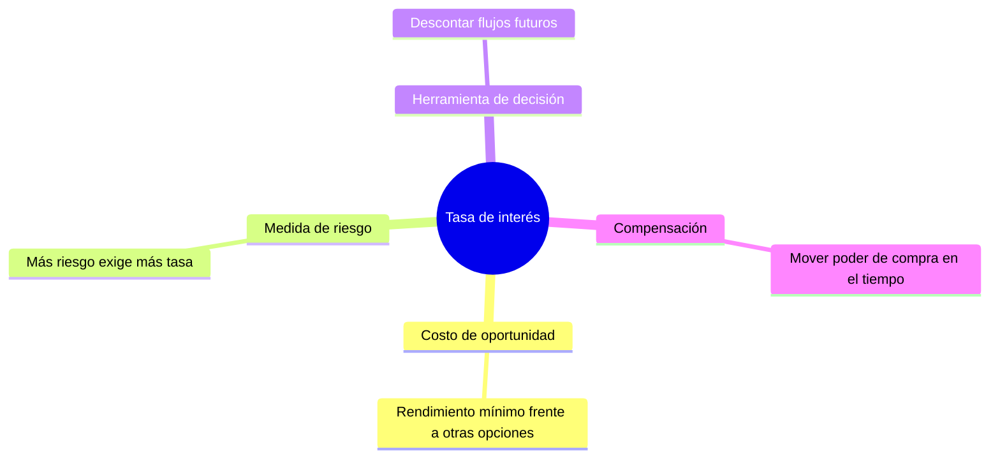

# La tasa de interés

> [!abstract] En una frase
> La tasa de interés es el **precio del dinero en el tiempo**: cuánto cuesta tener
> dinero disponible hoy en lugar de mañana.

**Prerrequisitos:** [[valor-tiempo-del-dinero]], la idea que la tasa mide.
**Sigue con:** [[interes-simple]] e [[interes-compuesto]], las dos formas de aplicarla.

---

## Mapa: una tasa, cuatro lecturas

---

## Intuición

Todo bien tiene un precio que surge de la oferta y la demanda. El dinero también:
su precio es la tasa. Formalmente, es el **porcentaje al que está invertido un
capital por unidad de tiempo**.

> [!example] Analogía: la etiqueta de precio
> En un supermercado cada producto tiene una etiqueta. En el mercado financiero,
> "usar $\$1.000$ durante un año" también es un producto, y su etiqueta dice, por
> ejemplo, $10\%$. Quien pide prestado paga ese precio; quien presta lo cobra.

Esa misma etiqueta se puede leer de cuatro formas, y las cuatro aparecen en la
materia.

---

## 1. Como costo de oportunidad

Quien invierte en una alternativa renuncia a todas las demás de riesgo similar.
La tasa exigida es el **rendimiento mínimo** que tiene que dar una inversión para
ser atractiva frente a esas otras opciones.

> [!example] Ejemplo
> Tenés un plazo fijo seguro al $8\%$ anual y te ofrecen un proyecto de riesgo
> similar al $6\%$. **No conviene**: renunciar al plazo fijo te cuesta más de lo
> que el proyecto devuelve.

Esta idea es la base de toda la [[tasa-de-descuento]].

## 2. Como medida de riesgo

Cuanto más riesgoso es un proyecto, más tasa exige el mercado para compensar la
mayor probabilidad de pérdida.

> [!example] Ejemplo
> Un bono del Tesoro de un país estable paga $4\%$ anual; un bono de una empresa
> en dificultades, $15\%$. Esos 11 puntos de diferencia son **puro riesgo de no
> cobrar**.

> [!tip] Principio de diferenciación de tasas
> Si todas las opciones pagaran lo mismo (digamos $10\%$), todo el capital iría a
> la más segura y los proyectos riesgosos quedarían sin financiamiento. Que las
> tasas sean distintas es lo que permite que exista crédito para proyectos
> riesgosos.

## 3. Como herramienta de decisión

La tasa permite **descontar** flujos futuros, es decir, traerlos a valor presente.

$$
\text{Valor hoy} = \frac{\$1.000}{1{,}10} \approx \$909
$$

$\$1.000$ que llegan dentro de un año, con una tasa del $10\%$, valen hoy unos
$\$909$. Es exactamente la operación del [[valor-actual-neto]].

## 4. Como compensación por transferir poder adquisitivo

Desde la perspectiva del flujo, es lo que el deudor paga (o el acreedor cobra)
por mover poder de compra de un momento a otro.

> [!example] Ejemplo
> Un préstamo personal al $60\%$ anual para comprar una notebook: esa tasa es el
> precio de consumir hoy en lugar de esperar a juntar el dinero.

---

## Errores comunes

| Error | Lo correcto |
|---|---|
| "El costo de oportunidad es lo que pago." | Es lo que **dejo de ganar** en la mejor alternativa descartada. |
| "Si un bono paga mucho, es una ganga." | Una tasa alta suele ser compensación por riesgo. |
| "Descontar es restar la tasa." | Descontar es **dividir** por $(1+i)^t$. |

---

## Autoevaluación

1. Un proyecto pide $\$50.000$ hoy y devuelve $\$54.500$ en un año. La
   alternativa segura de riesgo similar rinde $9\%$. ¿Conviene?
   > [!question]- Respuesta
   > Tasa del proyecto: $54.500 / 50.000 - 1 = 9\%$. Rinde **exactamente** lo
   > mismo que el costo de oportunidad: es **indiferente**. No hay razón económica
   > para cambiar de alternativa.

2. ¿Cuánto vale hoy un cobro de $\$2.200$ dentro de un año, si la tasa es $10\%$?
   > [!question]- Respuesta
   > $2.200 / 1{,}10 = \$2.000$.

---

## Relacionado

- [[valor-tiempo-del-dinero]]: la idea que la tasa pone en números.
- [[interes-compuesto]]: cómo se aplica la tasa período tras período.
- [[ecuacion-de-fisher]]: separa la parte de la tasa que es inflación.
- [[tasa-de-descuento]]: la lectura 1 (costo de oportunidad) aplicada a proyectos.
