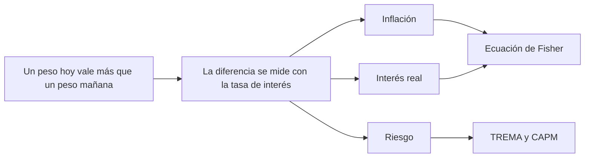

# Valor tiempo del dinero

> [!abstract] En una frase
> Un peso hoy vale más que un peso mañana, porque hoy lo podés invertir, gastar o
> proteger. Toda la materia se construye sobre esta idea.

**Prerrequisitos:** ninguno, es el punto de partida.
**Sigue con:** [[tasa-de-interes]], la herramienta que mide esa diferencia.

---

## Mapa de la página

---

## El problema que resuelve

Si no existiera esta idea, sumaríamos pesos de distintos años como si fueran lo
mismo. Un proyecto que devuelve $\$1.000$ dentro de 10 años parecería igual de
bueno que uno que los devuelve mañana. Esa es justamente la trampa de los
indicadores contables como el [[roi-y-roa|ROI]].

## Intuición

Te ofrecen $\$1.000$ hoy o $\$1.000$ dentro de un año. Todos elegimos hoy, aunque
el monto sea idéntico. ¿Por qué?

- Hoy los puedo **invertir** y dentro de un año tener más.
- Dentro de un año los precios probablemente **subieron**.
- Dentro de un año **puede que no me paguen**.

Esa preferencia natural por el presente *es* el valor tiempo del dinero.

> [!example] Analogía: alquilar dinero es como alquilar un departamento
> Quien presta dinero es como el dueño de un departamento que lo alquila. El
> alquiler (la **tasa**) le tiene que cubrir tres cosas:
>
> | Departamento | Dinero | Componente de la tasa |
> |---|---|---|
> | El departamento se desgasta y pierde valor | Los precios suben y el dinero compra menos | **Inflación** |
> | Mientras lo alquila, el dueño no puede vivir ahí | Mientras presta, no puede consumir | **Interés real** |
> | El inquilino puede romper cosas o no pagar | El deudor puede no devolver | **Riesgo** |

---

## Los tres componentes de la tasa

| Componente | Qué compensa | Página que lo aísla |
|---|---|---|
| **Inflación** | La pérdida de poder de compra por el cambio en la valoración que la sociedad le da al dinero. | [[ecuacion-de-fisher]] |
| **Interés real** | La motivación para postergar el consumo disponible hoy (el interés propiamente dicho). | [[ecuacion-de-fisher]] |
| **Riesgo** | La probabilidad de que el dinero prestado o invertido no sea devuelto. | [[trema]], [[capm]] |

> [!example] Ejemplo: descomponer un plazo fijo del $45\%$ anual
> En un país con alta inflación, la mayor parte del $45\%$ compensa la inflación
> esperada. Otra parte compensa que el ahorrista posterga consumo. Si el banco no
> se percibe como totalmente seguro, una tercera parte compensa el riesgo de la
> entidad.

## Riesgo vs. retorno

La tasa es el resultado de un balance entre el riesgo asumido y la ganancia
posible: **más riesgo exige más retorno**.

| Nivel de riesgo | Instrumento | Retorno esperado |
|---|---|---|
| Bajo | Bono soberano | $\sim 5\%$ anual |
| Alto | Startup de IT | $30\%$ anual o más |

---

## Ejemplo con variación

**Caso:** un plazo fijo rinde $10\%$ anual. ¿$\$1.000$ hoy o $\$1.000$ en un año?
Hoy, porque en un año se convierten en $1.000 \times 1{,}10 = \$1.100$.

**Variación:** ¿y si en lugar de $\$1.000$ te ofrecen $\$1.050$ en un año?
Sigue conviniendo hoy ($\$1.100 > \$1.050$). Recién a partir de $\$1.100$ la
oferta futura empata. Ese $\$1.100$ es el **valor futuro** de $\$1.000$ al $10\%$:
la cuenta que formaliza el [[interes-compuesto]].

---

## Errores comunes

| Error | Lo correcto |
|---|---|
| "Si los montos son iguales, da lo mismo cuándo cobro." | Montos iguales en fechas distintas **no** valen lo mismo. |
| "La tasa es solo inflación." | La inflación es uno de tres componentes; también están el interés real y el riesgo. |
| "Una tasa más alta siempre es mejor negocio." | Una tasa alta puede ser pura compensación por riesgo. |

---

## Autoevaluación

1. ¿Qué preferís: $\$5.000$ hoy o $\$5.400$ dentro de un año, si el plazo fijo
   rinde $6\%$?
   > [!question]- Respuesta
   > Hoy se convierten en $5.000 \times 1{,}06 = \$5.300$ en un año. Como
   > $\$5.400 > \$5.300$, **conviene la oferta futura**, siempre que confíes en
   > que te paguen (riesgo).

2. Un bono soberano rinde $5\%$ y una startup promete $30\%$. ¿Cuál de los tres
   componentes explica la mayor parte de la diferencia?
   > [!question]- Respuesta
   > El **riesgo**. La inflación y el interés real son los mismos para ambos
   > inversores; lo que cambia es la probabilidad de no recuperar el dinero.

---

## Relacionado

- [[tasa-de-interes]]: la tasa como precio de esta diferencia, leída desde cuatro ángulos.
- [[ecuacion-de-fisher]]: separa inflación de interés real.
- [[tasa-de-descuento]]: aplica la idea para evaluar proyectos.
