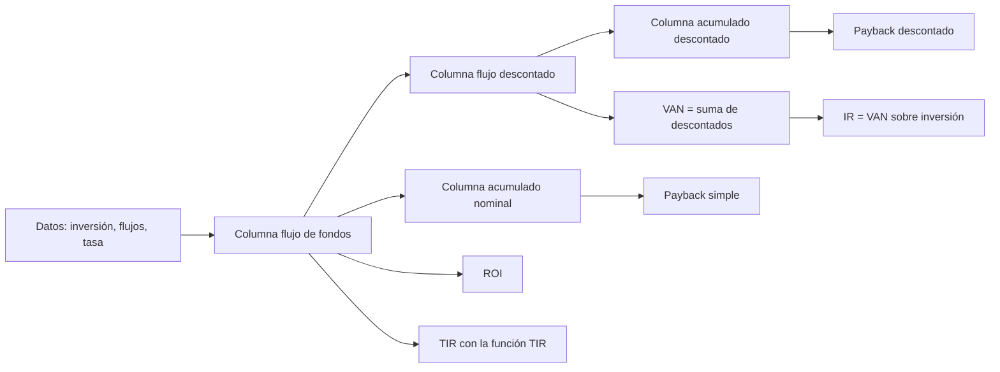

# Flujo de fondos

> [!abstract] En una frase
> El flujo de fondos es la **línea de tiempo de la plata del proyecto**: cuánto
> sale y cuánto entra en cada período. Todos los indicadores se calculan a partir
> de esta tabla.

**Prerrequisitos:** [[tecnicas-de-evaluacion-de-proyectos]], para saber qué indicadores vas a sacar.
**Sigue con:** [[roi-y-roa]], el primer indicador que se lee de la planilla.

---

## Intuición

> [!example] Analogía: el resumen de cuenta del proyecto
> Imaginá que el proyecto tiene su propia cuenta bancaria. El flujo de fondos es
> su **resumen de movimientos**, ordenado por año:
>
> - Débito grande el día 0 = la inversión inicial (con signo **negativo**)
> - Créditos en los años siguientes = los ingresos netos que genera
> - Saldo acumulado = cuánto falta, o sobra, para recuperar lo invertido

## Diagrama de línea de tiempo

Proyecto ejemplo de este bloque: inversión $\$10.000$, flujos de $\$3.000$ anuales
durante 5 años, tasa $10\%$.

```
           +3.000   +3.000   +3.000   +3.000   +3.000     entradas
              ^        ^        ^        ^        ^
   |----------|--------|--------|--------|--------|---->  tiempo (años)
   0          1        2        3        4        5
   |
   v
-10.000                                                   inversión
```

---

## Estructura de la planilla de la cátedra

La plantilla usa **cinco columnas**:

| Columna | Fórmula | Alimenta a |
|---|---|---|
| Período ($t$) | $0, 1, 2, \dots$ | Eje temporal |
| Flujo de fondos ($FF_t$) | Dato; en $t=0$ es $-\text{Inversión}$ | [[roi-y-roa\|ROI]] y [[tasa-interna-de-retorno\|TIR]] |
| Flujo descontado | $FF_t / (1+i)^t$ | [[valor-actual-neto\|VAN]] |
| Acumulado nominal | $\sum_{k \le t} FF_k$ | [[payback]] simple |
| Acumulado descontado | Suma de los descontados | Payback descontado |



## Ejemplo completo: la planilla llena

| $t$ | $FF_t$ | Descontado al $10\%$ | Acumulado nominal | Acumulado descontado |
|---|---|---|---|---|
| 0 | $-10.000$ | $-10.000{,}00$ | $-10.000$ | $-10.000{,}00$ |
| 1 | $3.000$ | $2.727{,}27$ | $-7.000$ | $-7.272{,}73$ |
| 2 | $3.000$ | $2.479{,}34$ | $-4.000$ | $-4.793{,}39$ |
| 3 | $3.000$ | $2.253{,}94$ | $-1.000$ | $-2.539{,}44$ |
| 4 | $3.000$ | $2.049{,}04$ | $2.000$ | $-490{,}40$ |
| 5 | $3.000$ | $1.862{,}76$ | $5.000$ | $1.372{,}36$ |

Resultados que se leen de la tabla:

| Indicador | Cálculo | Resultado |
|---|---|---|
| ROI | $15.000 / 10.000 - 1$ | $50\%$ |
| Payback simple | $3 + 1.000/3.000$ | $3{,}33$ años |
| Payback descontado | $4 + 490{,}40/1.862{,}76$ | $4{,}26$ años |
| VAN | Última celda del acumulado descontado | $\$1.372{,}36$ |
| IR | $1.372{,}36 / 10.000$ | $13{,}72\%$ |
| TIR | `=TIR()` sobre la columna de flujos, período 0 incluido | $15{,}24\%$ |

> [!tip] El VAN ya está en la tabla
> La última fila del **acumulado descontado** es el VAN. No hace falta calcularlo
> aparte.

Las fórmulas generales:

$$
ROI = \frac{\sum_{t \ge 1} FF_t}{C_0} - 1
\qquad
VAN = \sum_{t=0}^{n} \frac{FF_t}{(1+i)^t}
\qquad
IR = \frac{VAN}{C_0}
$$

---

## Convenciones de la planilla

> [!warning] Las cuatro reglas que evitan errores
> 1. El período 0 lleva la inversión con **signo negativo**. Si no, la TIR no
>    encuentra solución y el VAN sale mal.
> 2. El flujo del período 0 descontado es él mismo, porque $(1+i)^0 = 1$.
> 3. Si el ejercicio tiene menos períodos que filas, las sobrantes se dejan en
>    **cero, no se borran**: las fórmulas de resultados las referencian.
> 4. Si el ejercicio no da tasa, se deja en $0\%$ y las columnas descontadas
>    quedan iguales a las nominales.

### Código de colores del libro Excel

| Formato | Significado |
|---|---|
| **Texto azul** | Dato de entrada. Es lo único que se modifica. |
| **Texto negro** | Fórmula que se recalcula sola. |
| **Texto verde** | Fórmula que trae un dato de otra hoja del libro. |
| **Relleno amarillo** | Dato clave a completar o supuesto a confirmar. |

---

## Autoevaluación

1. Inversión $\$25.000$; flujos $\$8.000$, $\$8.000$, $\$9.000$, $\$9.000$. Armá el
   acumulado nominal. ¿En qué período se recupera?
   > [!question]- Respuesta
   > Acumulado: $-25.000$, $-17.000$, $-9.000$, $0$, $9.000$. Llega a cero **justo
   > al cierre del año 3**: payback de 3 años exactos.

2. ¿Por qué no se puede borrar una fila sobrante de la planilla?
   > [!question]- Respuesta
   > Las celdas de resultados (VAN, ROI, TIR) referencian el rango completo.
   > Borrar filas rompe las referencias; poner ceros no altera ninguna suma.

---

## Relacionado

- [[valor-actual-neto]]: la suma de la columna descontada.
- [[payback]]: se lee de las columnas acumuladas.
- [[roi-y-roa]] y [[tasa-interna-de-retorno]]: salen de la columna de flujos.
- [[ejercicios-van-tir]]: los ejercicios que usan esta plantilla.
