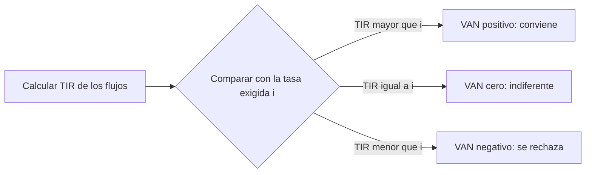

# TIR (Tasa Interna de Retorno)

> [!abstract] En una frase
> La TIR es la **tasa que hace cero el VAN**: el rendimiento propio del proyecto.
> Sola no decide nada; siempre se compara contra la tasa exigida.

**Prerrequisitos:** [[valor-actual-neto]].
**Sigue con:** [[tasa-de-descuento]], la tasa contra la que se compara.

---

## Intuición

> [!example] Analogía 1: el préstamo máximo que aguanta el proyecto
> Financiás el proyecto con un préstamo. ¿Cuál es la **tasa más alta** que podrías
> pagar y todavía salir hecho, sin ganar ni perder? Esa tasa es la TIR.
>
> - Si el banco te cobra **menos** que la TIR, te sobra plata: VAN positivo.
> - Si te cobra **más**, no te alcanza: VAN negativo.

> [!example] Analogía 2: el salto en alto
> - La **TIR** es hasta qué altura puede saltar el proyecto (depende solo del
>   proyecto).
> - La **tasa exigida** ([[trema]], [[wacc]], [[capm]]) es la altura de la varilla
>   (depende de quién evalúa).
> - El proyecto "pasa" si salta más alto que la varilla.
>
> La misma TIR puede pasar una varilla baja y fallar una alta.

---

## Definición formal

$$
\sum_{t=0}^{n} \frac{FF_t}{(1+TIR)^t} = 0
$$

Es la tasa que iguala el valor actual de los flujos futuros con el desembolso
inicial.

**Por qué es "interna":** no depende de ninguna tasa externa, solo de los flujos.
Por eso se puede calcular **antes** de decidir qué [[tasa-de-descuento]] usar.

## Gráficamente

![[perfil-del-van.svg|600]]

La curva muestra el VAN del proyecto ejemplo ($\$10.000$; $\$3.000 \times 5$)
para cada tasa posible. **La TIR es donde la curva cruza el eje: $15{,}24\%$.**
Cualquier tasa exigida a la izquierda de ese punto da VAN positivo.

---

## Regla de decisión

$$
TIR > i \Rightarrow VAN > 0 \Rightarrow \text{conviene}
\qquad
TIR < i \Rightarrow VAN < 0 \Rightarrow \text{se rechaza}
$$

> [!danger] La TIR sola no decide nada
> Caso de la Clase 5: inversión $\$10.000$; flujos $\$2.500$, $\$5.000$ y $\$7.000$;
> $TIR \approx 18\%$ (exactamente $17{,}84\%$).
>
> | Tasa exigida | VAN | Decisión |
> |---|---|---|
> | $20\%$ | $-\$394$ | ❌ No conviene |
> | $15\%$ | $+\$557$ | ✅ Conviene |
>
> **Mismos flujos, misma TIR, decisión opuesta.**

## Cálculo

No tiene solución algebraica cerrada: se resuelve **por iteración** (probar
tasas hasta que el VAN dé cero). En Excel: `=TIR(rango)` (`IRR` en inglés) sobre
la columna de flujos, **incluyendo el período 0 con la inversión en negativo**.

> [!tip] Verificar a mano en el parcial
> Si sospechás que la TIR está entre dos tasas, calculá el VAN en ambas. Si una da
> positivo y la otra negativo, la TIR está en el medio. En el ejemplo:
> $VAN_{15\%} = +56$ y $VAN_{20\%} = -1.028$, así que la TIR está entre $15\%$ y
> $20\%$, muy cerca de $15\%$.

## Ejemplos de la práctica

| Ejercicio | Flujos | TIR | Tasa exigida | VAN a esa tasa | Decisión |
|---|---|---|---|---|---|
| Ej. 1 | $-18.000$; $5.000$, $6.000$, $6.000$, $7.000$ | $11{,}92\%$ | $15\%$ | $-\$1.167{,}94$ | ❌ |
| Ej. 4 | $-20.000$; $7.000 \times 4$ | $14{,}96\%$ | $18\%$ | $-\$1.169{,}57$ | ❌ |

En ambos el VAN a la tasa exigida da negativo, como tenía que pasar.

---

## Limitaciones

> [!failure] Tres cosas que la TIR no resuelve
> 1. **Múltiples soluciones:** si el flujo cambia de signo más de una vez, puede
>    haber varias TIR, o ninguna.
> 2. **No considera la escala:** entre dos proyectos mutuamente excluyentes puede
>    contradecir al VAN. Ante la duda, **manda el VAN**.
> 3. **No dice nada sobre el riesgo** de que los flujos proyectados se cumplan.

**Ejemplo del problema de escala** (tasa $10\%$):

| | Proyecto A | Proyecto B |
|---|---|---|
| Flujos | $-1.000$; $+1.500$ en un año | $-10.000$; $+12.000$ en un año |
| TIR | $50\%$ | $20\%$ |
| VAN al $10\%$ | $\$364$ | $\$909$ |
| ¿Cuál elige la TIR? | ✅ | |
| ¿Cuál crea más valor? | | ✅ |

Si solo podés hacer uno, B te deja más valor en pesos, aunque A tenga mejor
porcentaje.

---

## Errores comunes

| Error | Lo correcto |
|---|---|
| "TIR de $18\%$, entonces conviene." | Depende de la tasa exigida. |
| "Si cambia la tasa de descuento, cambia la TIR." | La TIR depende solo de los flujos. |
| Olvidar el período 0 en `=TIR()`. | Sin el flujo negativo no hay solución. |
| Elegir entre proyectos excluyentes por mayor TIR. | Elegir por mayor VAN. |

---

## Autoevaluación

1. Inversión $\$35.000$; flujos $\$12.000 \times 3$; tasa $9\%$. Sabiendo que
   $TIR = 1{,}42\%$, ¿conviene? ¿Qué signo tiene el VAN?
   > [!question]- Respuesta
   > $TIR = 1{,}42\% < 9\%$: **no conviene**, y el VAN al $9\%$ es negativo
   > ($-\$4.624{,}46$). Los flujos apenas superan la inversión en términos
   > nominales ($\$36.000$ contra $\$35.000$).

2. Un proyecto tiene $TIR = 14\%$. La empresa A exige $12\%$ y la B, $16\%$. ¿Qué
   decide cada una?
   > [!question]- Respuesta
   > A lo acepta ($14\% > 12\%$, VAN positivo); B lo rechaza ($14\% < 16\%$, VAN
   > negativo). El proyecto es el mismo; lo que cambia es la tasa exigida.

---

## Relacionado

- [[valor-actual-neto]]: la TIR es la tasa donde el VAN vale cero.
- [[tasa-de-descuento]]: la varilla contra la que se compara.
- [[wacc-vs-capm]]: flujo de trabajo completo de TIR, tasa y VAN.
- [[indice-de-rentabilidad]]: la otra medida relativa.
- [[ejercicios-van-tir]]: práctica resuelta.
