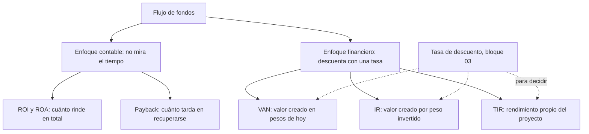
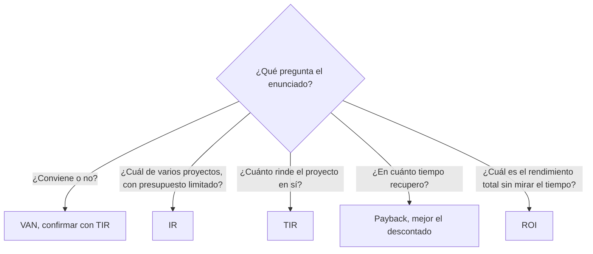

# Técnicas de evaluación de proyectos

> [!abstract] En una frase
> Hay dos formas de evaluar un proyecto: la **contable** (ROI, payback), que
> ignora *cuándo* llega la plata, y la **financiera** (VAN, IR, TIR), que la trae
> toda a valor de hoy. La materia usa la segunda.

**Prerrequisitos:** [[interes-compuesto]] y [[valor-tiempo-del-dinero]].
**Sigue con:** [[flujo-de-fondos]], la tabla de la que salen todos los indicadores.

---

## Mapa del bloque

**Orden sugerido de lectura:** [[flujo-de-fondos]], [[roi-y-roa]], [[payback]],
[[valor-actual-neto]], [[indice-de-rentabilidad]], [[tasa-interna-de-retorno]].

---

## Intuición: dos formas de mirar el mismo proyecto

> [!example] Analogía: dos ofertas de trabajo
> Dos empresas te ofrecen un contrato de 3 años por $\$120.000$ en total.
>
> - **A** te paga todo el primer día.
> - **B** te paga todo al terminar los 3 años.
>
> Una mirada **contable** dice "son iguales: $\$120.000$ cada una". Una mirada
> **financiera** dice "A es mucho mejor": podés invertir esa plata durante 3 años,
> la inflación no se la come y no corrés el riesgo de que B no pague.

## Enfoque tradicional (evaluación contable)

Se apoya en registros contables estándar. **No distingue el momento** en que
ocurren ingresos y egresos y trabaja en valor nominal. Es mirar la utilidad
promedio sin importar si el beneficio llega en el año 1 o en el año 5.
Indicadores: [[roi-y-roa]] y [[payback]].

## Enfoque económico (evaluación financiera)

Analiza la viabilidad real a través del [[flujo-de-fondos]] (el *timing* de la
caja) y trata el **costo de capital como un dato explícito y clave**. Es armar el
flujo año por año y descontar cada período a una tasa.
Indicadores: [[valor-actual-neto]], [[indice-de-rentabilidad]] y
[[tasa-interna-de-retorno]].

---

## Los cinco indicadores, comparados

| Indicador | Qué mide | ¿Considera el tiempo? | ¿Necesita tasa? | Regla de decisión |
|---|---|---|---|---|
| [[roi-y-roa\|ROI]] | Rendimiento total sobre el capital invertido | ❌ | ❌ | ROI alto es mejor |
| [[payback]] | Cuánto tarda en recuperarse la inversión | Solo el descontado | Solo el descontado | Menor plazo es mejor |
| [[valor-actual-neto\|VAN]] | Valor creado hoy, en pesos | ✅ | ✅ | $VAN > 0$: conviene |
| [[indice-de-rentabilidad\|IR]] | Valor creado por peso invertido | ✅ | ✅ | $IR > 0$: conviene |
| [[tasa-interna-de-retorno\|TIR]] | Rendimiento propio del proyecto | ✅ | Para calcularla no; para decidir sí | $TIR > i$: conviene |

**Similitudes:** los cinco salen de la misma planilla de [[flujo-de-fondos]].
**Diferencia clave:** solo VAN, IR y TIR incorporan el
[[valor-tiempo-del-dinero]] y el costo de financiar el proyecto.

---

## Por qué los indicadores contables no alcanzan

> [!danger] El caso canónico del parcial (Ejercicio 1, Matemática Financiera II)
> Inversión $\$18.000$; flujos $\$5.000$, $\$6.000$, $\$6.000$, $\$7.000$; tasa $15\%$.
>
> | Indicador | Resultado | ¿Qué dice? |
> |---|---|---|
> | ROI | $33{,}3\%$ | "Sí" |
> | Payback simple | $3{,}14$ años | "Razonable" |
> | VAN | $-\$1.168$ | **No** |
> | TIR | $11{,}9\%$, por debajo de $15\%$ | **No** |
>
> ROI y payback dicen que sí; VAN y TIR dicen que no. **El proyecto destruye
> valor.**

La razón: ROI y payback ignoran dos cosas que el VAN sí incorpora, el
[[valor-tiempo-del-dinero]] y el costo de financiar el proyecto
([[tasa-de-descuento]]).

## Coherencia entre VAN, IR y TIR

En un proyecto **convencional** (una inversión negativa al inicio seguida de
flujos positivos) los tres **siempre** apuntan en la misma dirección, porque son
lecturas distintas del mismo cálculo:

$$
VAN > 0 \iff IR > 0 \iff TIR > i
$$

> [!warning] Cuándo pueden discrepar
> - **Al comparar dos proyectos entre sí:** VAN mide pesos y TIR mide porcentaje.
>   El proyecto más grande puede tener más VAN y menos TIR.
> - **Si el flujo cambia de signo más de una vez:** la TIR puede tener varias
>   soluciones o ninguna.

---

## ¿Qué indicador uso?

---

## Errores comunes

| Error | Lo correcto |
|---|---|
| "ROI alto, entonces conviene." | El ROI no mira el tiempo ni la tasa; puede decir que sí con VAN negativo. |
| "VAN, IR y TIR pueden contradecirse al evaluar un solo proyecto." | En un proyecto convencional siempre coinciden. |
| "Si la TIR es mayor, ese proyecto es mejor." | Entre proyectos de distinta escala, manda el VAN. |

---

## Autoevaluación

1. ¿Por qué un ROI de $33\%$ puede convivir con un VAN negativo?
   > [!question]- Respuesta
   > El ROI suma flujos de distintos años como si valieran lo mismo y no
   > descuenta el costo de capital. Si esos flujos, descontados al $15\%$, no
   > alcanzan a cubrir la inversión, el VAN es negativo aunque la suma nominal sea
   > mayor que la inversión.

2. Un proyecto convencional tiene $VAN = +\$500$ al $12\%$. ¿Qué podés decir de
   su TIR y de su IR sin calcularlos?
   > [!question]- Respuesta
   > $TIR > 12\%$ e $IR > 0$. En un proyecto convencional los tres indicadores
   > coinciden.

---

## Relacionado

- [[flujo-de-fondos]]: la planilla común a los cinco indicadores.
- [[tasa-de-descuento]]: de dónde sale la $i$ que usan VAN, IR y TIR.
- [[ejercicios-van-tir]]: práctica resuelta y 10 casos de IT.
