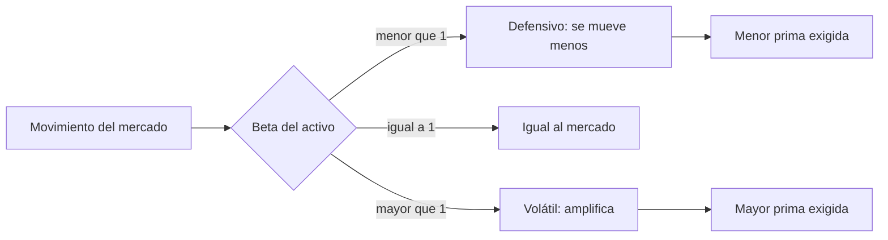

# Beta ($\beta$)

> [!abstract] En una frase
> El beta mide **cuánto amplifica un activo los movimientos del mercado**. Es el
> número que multiplica la prima de mercado en el [[capm]].

**Prerrequisitos:** [[capm]], la fórmula donde se usa.
**Sigue con:** [[riesgo-pais]], el término que no se multiplica por beta.

---

## Intuición

> [!example] Analogía: la perilla de volumen
> El mercado es una canción que sube y baja. Cada activo la reproduce con su
> propia **perilla de volumen**:
>
> | Perilla | $\beta$ | Si el mercado sube $10\%$... | Si baja $10\%$... |
> |---|---|---|---|
> | Bajita | $0{,}5$ | sube unos $5\%$ | baja unos $5\%$ |
> | Normal | $1$ | sube $10\%$ | baja $10\%$ |
> | Al máximo | $2$ | sube unos $20\%$ | baja unos $20\%$ |
>
> Más volumen es más emoción en las subas **y** más dolor en las bajas. Por eso un
> beta alto exige más rendimiento.

---

## Lectura del valor

| Rango | Nombre | Comportamiento | Ejemplo histórico (2002-2012) |
|---|---|---|---|
| $\beta < 1$ | Defensivo | Se mueve menos que el mercado | Walmart (WMT), $\beta = 0{,}34$: relativamente estable en la crisis de 2008 |
| $\beta = 1$ | Mercado | Se mueve igual, por definición | Índice Dow Jones, $\beta = 1{,}00$ |
| $\beta > 1$ | Volátil | Amplifica subas y bajas | Citigroup (NYSE:C), $\beta = 2{,}56$: cayó casi $92\%$ en 2008 |

## El beta depende del sector

Los proyectos que **no cotizan en bolsa** (típico en tecnología) no tienen beta
propio. Se usa el **beta promedio del sector más afín** como estimación.

Aun dentro de un mismo rubro hay dispersión (alimentos):

| Empresa | $\beta$ |
|---|---|
| General Mills | $0{,}17$ |
| Kellogg | $0{,}45$ |
| PepsiCo | $0{,}50$ |
| Las más volátiles del rubro | hasta $0{,}94$ |

## Fuente del dato

La referencia académica estándar es la **base de betas de Aswath Damodaran** (NYU
Stern), actualizada cada enero.

> [!tip] Dataset Global, no el de EE.UU.
> Para empresas que operan **fuera de Estados Unidos** se recomienda el dataset
> **Global**: tiene más comparables por sector y evita mezclar el riesgo propio del
> mercado estadounidense con el [[riesgo-pais]], que en el CAPM se suma aparte.

---

## Por qué importa el sector correcto

Con los datos de la clase ($r_f = 4{,}72\%$, $E(r_m) = 9{,}0\%$, $RP = 5{,}05\%$):

| $\beta$ | Sector | $E(r_i)$ |
|---|---|---|
| $0{,}17$ | Alimentos (General Mills) | $10{,}50\%$ |
| $1{,}12$ | Computer Services | $14{,}56\%$ |

> [!danger] No es un error de redondeo
> Usar el beta de alimentos **subestima en más de 4 puntos** la tasa que debería
> exigir un proyecto de tecnología. La demanda de alimentos es mucho más estable y
> su beta bajo refleja eso, no el riesgo del proyecto evaluado.

---

## Errores comunes

| Error | Lo correcto |
|---|---|
| "Beta alto, activo malo." | Beta alto es **más volátil**, y por eso exige más retorno. |
| Multiplicar el $RP$ por beta. | Beta multiplica solo la prima de mercado. |
| Usar el beta de la empresa más conocida del rubro. | Usar el **promedio del sector más afín**. |
| Usar el dataset de EE.UU. para Argentina. | Dataset Global. |

---

## Autoevaluación

1. Con los datos de la clase, ¿qué $E(r_i)$ da un $\beta = 0{,}5$? ¿Y $\beta = 1{,}8$?
   > [!question]- Respuesta
   > $\beta = 0{,}5$: $4{,}72 + 0{,}5 \times 4{,}28 + 5{,}05 = 11{,}91\%$.
   > $\beta = 1{,}8$: $4{,}72 + 1{,}8 \times 4{,}28 + 5{,}05 = 17{,}47\%$.
   > Diferencia: $5{,}56$ puntos, que es $1{,}3 \times 4{,}28$.

2. Si el mercado cae $20\%$, ¿cuánto se espera que caiga un activo con $\beta = 1{,}5$?
   > [!question]- Respuesta
   > Aproximadamente $30\%$, ya que amplifica el movimiento $1{,}5$ veces.

---

## Relacionado

- [[capm]]: donde se usa el beta.
- [[riesgo-pais]]: el término que no escala con beta.
- [[ejercicios-wacc-capm]]: ejercicios 1 y 5 de CAPM.
