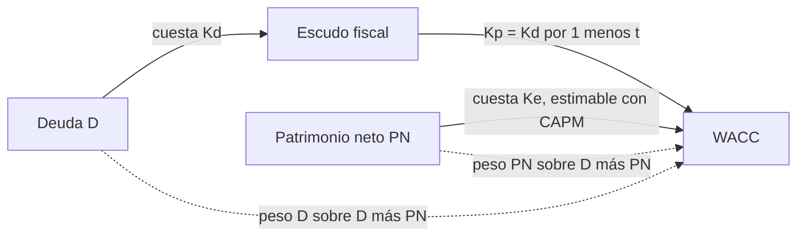

# Ecuación contable fundamental

> [!abstract] En una frase
> Todo lo que la empresa **tiene** (activo) lo pagó con plata **prestada** (pasivo)
> o **de los dueños** (patrimonio neto). El [[wacc]] promedia el costo de esas dos
> fuentes.

**Prerrequisitos:** ninguno, es un repaso.
**Sigue con:** [[escudo-fiscal]], por qué la deuda cuesta menos de lo que dice el contrato.

---

## Intuición

> [!example] Analogía: comprar una casa con hipoteca
> Comprás una casa de $\$100$. Pusiste $\$20$ de tus ahorros y el banco te prestó
> $\$80$.
>
> | Casa | Empresa |
> |---|---|
> | La casa ($\$100$) | **Activo** |
> | La hipoteca ($\$80$) | **Pasivo** o deuda ($D$) |
> | Tus ahorros ($\$20$) | **Patrimonio neto** o capital propio ($PN$, $E$) |
>
> $100 = 80 + 20$. La casa siempre es igual a lo que debés más lo que es tuyo.
> Estos son exactamente los números del caso de WACC de la clase.

---

## La ecuación

$$
\text{Activo} = \text{Pasivo} + \text{Patrimonio Neto}
$$

```
┌─────────────────────────┬─────────────────────────┐
│         ACTIVO          │   PASIVO (Deuda, D)     │
│   lo que la empresa     │   $80 · cuesta Kd       │
│        TIENE            ├─────────────────────────┤
│         $100            │ PATRIMONIO NETO (PN, E) │
│                         │   $20 · cuesta Ke       │
└─────────────────────────┴─────────────────────────┘
   en qué se usó la plata     de dónde salió la plata
```

| Concepto | Qué incluye |
|---|---|
| **Activo (A)** | Bienes y derechos: caja, bancos, instalaciones, rodados, deudores y otros créditos a cobrar. |
| **Pasivo o Deuda (D)** | Compromisos con terceros: proveedores, préstamos bancarios, acreedores, otras deudas. |
| **Patrimonio Neto (PN) o Capital (*Equity*, E)** | Lo que les corresponde a los dueños (accionistas). Se calcula como Activo menos Pasivo. |

---

## Por qué importa para el WACC

Las dos fuentes de financiamiento **tienen costos distintos**:



- La deuda cuesta $K_d$ (la tasa que cobran los acreedores). Después del
  [[escudo-fiscal]] se convierte en $K_p$.
- El capital propio cuesta $K_e$ (la tasa que exigen los accionistas). Se puede
  estimar con el [[capm]].

El [[wacc]] pondera esos costos por el **peso relativo** de cada fuente:

$$
\text{peso de la deuda} = \frac{D}{D + PN}
\qquad
\text{peso del capital propio} = \frac{PN}{D + PN}
$$

> [!tip] Los pesos suman 1
> $\dfrac{D}{D+PN} + \dfrac{PN}{D+PN} = 1$. Si te dan "$30\%$ deuda", el capital
> propio es $70\%$ sin calcular nada más.

---

## Autoevaluación

1. Una empresa tiene activos por $\$250.000$ financiados $30\%$ con deuda. ¿Cuánto
   es $D$ y cuánto $PN$?
   > [!question]- Respuesta
   > $D = 0{,}30 \times 250.000 = \$75.000$ y
   > $PN = 250.000 - 75.000 = \$175.000$ ($70\%$).

2. ¿Por qué el WACC no es el promedio simple de $K_p$ y $K_e$?
   > [!question]- Respuesta
   > Porque cada fuente financia una proporción distinta del activo. Si la deuda
   > financia $80\%$, su costo tiene que pesar $80\%$ en el promedio.

---

## Relacionado

- [[wacc]]: usa $D$ y $PN$ como pesos.
- [[escudo-fiscal]]: el ajuste al costo de la deuda.
- [[capm]]: cómo estimar $K_e$.
