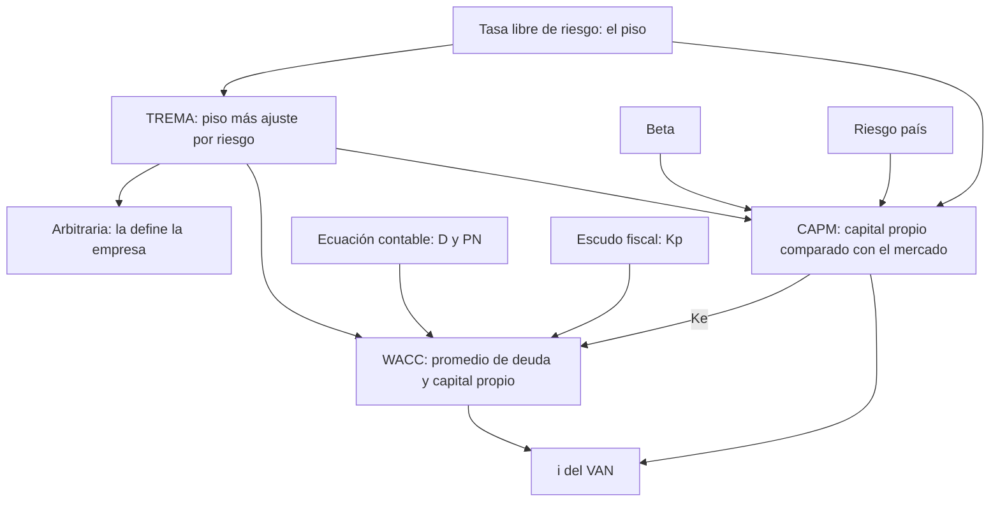

# La tasa de descuento

> [!abstract] En una frase
> La tasa de descuento es la **vara con la que se mide el proyecto**: el
> rendimiento mínimo que tiene que superar, porque ese capital podría estar
> rindiendo en otro lado.

**Prerrequisitos:** [[valor-actual-neto]] y [[tasa-interna-de-retorno]], que la usan.
**Sigue con:** [[tasa-libre-de-riesgo]], el piso de todas las tasas.

---

## Mapa del bloque



**Orden sugerido:** [[tasa-libre-de-riesgo]], [[trema]],
[[ecuacion-contable-fundamental]], [[escudo-fiscal]], [[wacc]], [[capm]],
[[beta]], [[riesgo-pais]], [[wacc-vs-capm]].

---

## El problema que resuelve

El [[valor-actual-neto]] divide por $(1+i)^t$. Pero **¿qué número es $i$?** Si lo
elegís mal, un proyecto bueno parece malo o al revés.

## Intuición: el costo de oportunidad

Cada peso puesto en el proyecto deja de estar disponible para un plazo fijo, para
otro proyecto de la economía real o para el mercado de acciones. La tasa de
descuento es **lo que ese peso rendiría en la mejor alternativa de riesgo
similar**.

> [!example] Analogía: la varilla del salto en alto
> - El proyecto salta hasta su [[tasa-interna-de-retorno|TIR]].
> - La tasa de descuento es la **altura de la varilla**.
> - Un proyecto más riesgoso tiene que saltar **más alto**: le suben la varilla.
>
> **Regla de riesgo:** cuanto mayor es el riesgo percibido, mayor es el
> rendimiento exigido para compensarlo.

---

## Por qué elegirla bien es crítico

| | Proyecto base | Escenario 1 | Escenario 2 |
|---|---|---|---|
| Inversión | $\$10.000$ | | |
| Flujos | $\$2.500$ / $\$5.000$ / $\$7.000$ | | |
| TIR | $\approx 18\%$ | $\approx 18\%$ | $\approx 18\%$ |
| Tasa aplicada | | RFR $20\%$ | WACC $15\%$ |
| VAN | | $-\$394$ | $+\$557$ |
| Decisión | | ❌ No conviene | ✅ Sí conviene |

El mismo proyecto, con flujos idénticos y la misma TIR, **conviene o no según la
tasa aplicada**.

> [!important] Regla de oro
> Antes de calcular cualquier VAN o TIR, entender de dónde sale la tasa. No alcanza
> con saber calcular: hay que saber **justificar el origen** de la tasa usada.

---

## La escalera de tasas, de menor a mayor riesgo

```
                                          ┌──────────────────────────┐
                                          │ 4. Costo de financiación │  WACC o CAPM
                              ┌───────────┴──────────────────────────┤
                              │ 3. TREMA                             │  RFR + ajuste por riesgo
                  ┌───────────┴──────────────────────────────────────┤
                  │ 2. Tasa libre de riesgo (RFR)                    │  Bono del Tesoro de EE.UU. a 10 años
      ┌───────────┴──────────────────────────────────────────────────┤
      │ 1. Tasa de mínimo riesgo                                     │  Plazo fijo, caja de ahorro
      └──────────────────────────────────────────────────────────────┘
        menos riesgo  ─────────────────────────────────>  más riesgo, más tasa exigida
```

1. **Tasa de mínimo riesgo:** la de un plazo fijo o caja de ahorro. La referencia
   más conservadora del sistema local.
2. **[[tasa-libre-de-riesgo|Tasa libre de riesgo (RFR)]]:** instrumentos con
   riesgo de impago prácticamente nulo.
3. **[[trema]]:** el mínimo que un inversor le exige a un proyecto según su
   riesgo específico. Es la RFR más un ajuste.
4. **Costo de financiación de la empresa:** se calcula con [[wacc]] (si se conoce
   la estructura de deuda y capital) o con [[capm]] (comparando con el mercado).

---

## Síntesis: TREMA, WACC y CAPM

| | Qué es | Cuándo se usa |
|---|---|---|
| **[[trema]]** | Concepto general de rendimiento mínimo exigido | Para expresar la exigencia de un inversor de forma genérica |
| **[[wacc]]** | Costo promedio ponderado de las fuentes de financiamiento | Cuando se conoce la estructura real de deuda y capital propio |
| **[[capm]]** | Costo de los fondos propios estimado contra el mercado | Cuando no hay estructura de deuda definida, o desde la óptica del accionista |

> [!tip] No son rivales
> TREMA es el **concepto**; WACC y CAPM son **métodos** para calcularla. En la
> práctica, el CAPM se usa para obtener el $K_e$ que después entra en el WACC. Ver
> [[wacc-vs-capm]].

---

## Autoevaluación

1. ¿Por qué no se puede evaluar un proyecto de IT en Argentina con la tasa de un
   bono del Tesoro de EE.UU.?
   > [!question]- Respuesta
   > Esa tasa es el **piso sin riesgo**. El proyecto tiene riesgo de mercado,
   > sectorial y de país, y cada uno exige una prima adicional. Usar solo la RFR
   > subestimaría la varilla y aceptaría proyectos que destruyen valor.

2. Un proyecto tiene $TIR = 16\%$. ¿Conviene?
   > [!question]- Respuesta
   > **Falta información.** Hay que conocer la tasa exigida: conviene si es menor al
   > $16\%$ y no conviene si es mayor.

---

## Relacionado

- [[tasa-de-interes]]: la tasa como costo de oportunidad.
- [[valor-actual-neto]]: donde se usa la tasa.
- [[wacc-vs-capm]]: el cierre del bloque.
- [[ejercicios-wacc-capm]]: práctica.
