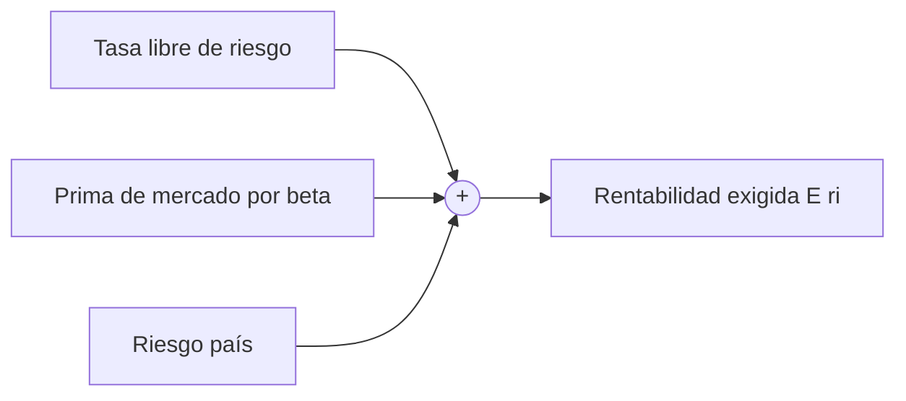

# Tasa libre de riesgo (RFR)

> [!abstract] En una frase
> La RFR ($r_f$) es lo que rinde un activo **que casi seguro te paga**, el bono del
> Tesoro de EE.UU. a 10 años. Es el **piso** sobre el que se apilan todas las
> primas de riesgo.

**Prerrequisitos:** [[tasa-de-descuento]], el mapa del bloque.
**Sigue con:** [[trema]], el piso más un ajuste por riesgo.

---

## Intuición

> [!example] Analogía: el nivel del mar
> La altura de una montaña se mide **desde el nivel del mar**. Las tasas de las
> inversiones riesgosas se miden desde la RFR:
>
> - Nivel del mar = $r_f$
> - Altura de cada montaña = prima de riesgo de cada inversión
> - Altitud total = tasa exigida
>
> Nadie usa el nivel del mar como altitud de una montaña; tampoco se usa la RFR
> sola para evaluar un proyecto con riesgo.

---

## De dónde sale el dato

La referencia global son los **bonos del Tesoro de EE.UU. a 10 años**, el estándar
del análisis financiero internacional. Se consulta en:

- **FRED** (Federal Reserve Economic Data), serie **DGS10**:
  `fred.stlouisfed.org/series/DGS10`
- El sitio del **U.S. Department of the Treasury**

> [!warning] Cambia todos los días
> Es un **dato de mercado**, no un valor fijo de tabla. Junto con el
> [[riesgo-pais]], es uno de los dos datos que hay que actualizar antes de resolver
> un ejercicio de [[capm]].

> [!note] Valores usados en clase
> $r_f = 4{,}72\%$ (caso de la calculadora), $r_f = 4{,}74\%$ (1 de agosto de 2026)
> y $r_f = 4{,}3\%$ (ejercicio integrador de la Clase 6).

## Cómo se usa

No se aplica directamente a proyectos con riesgo: es un **punto de partida**. Sobre
ella se suman primas:

$$
\text{TREMA} = r_f + \text{ajuste por riesgo}
$$

En el [[capm]] ese ajuste se formaliza con dos primas explícitas: la prima de
mercado ajustada por [[beta]] y el [[riesgo-pais]].

---

## El detalle contraintuitivo: subir $r_f$ puede bajar el CAPM

En el CAPM, $r_f$ aparece **dos veces con signo contrario**:

$$
E(r_i) = \underbrace{r_f}_{\text{suma}} + \beta\,[\,E(r_m) \underbrace{- r_f}_{\text{resta}}\,] + RP
$$

Agrupando los términos que tienen $r_f$:

$$
E(r_i) = r_f\,(1 - \beta) + \beta\,E(r_m) + RP
$$

| Si... | Entonces $(1-\beta)$ es... | Subir $r_f$... |
|---|---|---|
| $\beta < 1$ | positivo | **sube** $E(r_i)$ |
| $\beta = 1$ | cero | no cambia nada |
| $\beta > 1$ | negativo | **baja** $E(r_i)$ |

> [!example] Ejercicio 6 de la práctica
> $\beta = 1{,}12$, $E(r_m) = 9\%$, $RP = 5{,}05\%$. Subir $r_f$ de $4{,}72\%$ a
> $6{,}72\%$ (2 puntos):
>
> - Efecto directo: $+2$ puntos.
> - Efecto en la prima: $-2 \times 1{,}12 = -2{,}24$ puntos.
> - Neto: $-0{,}24$ puntos. $E(r_i)$ pasa de $14{,}56\%$ a $14{,}32\%$.
>
> Esto supone que $E(r_m)$ queda fijo. Si el mercado también subiera, el
> resultado sería otro.

---

## Errores comunes

| Error | Lo correcto |
|---|---|
| Usar la RFR como tasa de descuento de un proyecto con riesgo. | Es el piso; faltan las primas. |
| Usar un valor de $r_f$ viejo. | Actualizarlo el día del cálculo (FRED DGS10). |
| "Si sube $r_f$, sube el CAPM." | Solo con $\beta < 1$; con $\beta > 1$ baja, si $E(r_m)$ se mantiene. |
| Restar $r_f$ distinto al que sumás. | La $r_f$ de la prima y la sumada son la misma, del mismo período. |

---

## Autoevaluación

1. Con $\beta = 0{,}8$, $E(r_m) = 9\%$, $RP = 5{,}05\%$: ¿qué pasa con $E(r_i)$ si
   $r_f$ sube de $4{,}72\%$ a $5{,}72\%$?
   > [!question]- Respuesta
   > $E(r_i)$ pasa de $13{,}19\%$ a $13{,}39\%$: **sube $0{,}2$ puntos**, porque
   > $1 - \beta = 0{,}2 > 0$.

2. ¿Por qué se usa el bono del Tesoro de EE.UU. y no un bono argentino?
   > [!question]- Respuesta
   > Porque se busca un riesgo de impago prácticamente nulo. El bono argentino
   > incluye riesgo país, que en el CAPM se suma **aparte** como $RP$; usarlo como
   > $r_f$ lo contaría dos veces.

---

## Relacionado

- [[trema]]: RFR más ajuste por riesgo.
- [[capm]]: donde $r_f$ aparece dos veces.
- [[riesgo-pais]]: el otro dato diario.
- [[tasa-de-descuento]]: la escalera de tasas.
