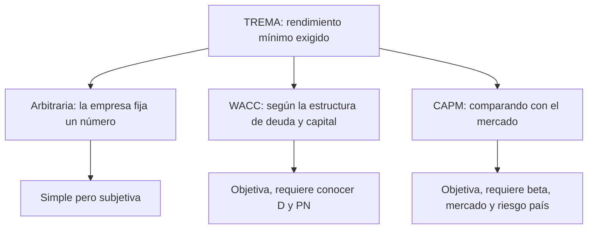

# TREMA

> [!abstract] En una frase
> La TREMA es el **rendimiento mínimo** que un inversor le exige a un proyecto para
> poner su plata. Es el concepto; WACC y CAPM son formas de calcularla.

**Prerrequisitos:** [[tasa-libre-de-riesgo]], el piso de la TREMA.
**Sigue con:** [[ecuacion-contable-fundamental]], para empezar a construir el WACC.

---

## Nombres

**TREMA** = Tasa de Rendimiento Mínima Aceptable. En inglés: **MARR** (*Minimum
Attractive Rate of Return*) o *hurdle rate*, literalmente "tasa valla".

## Intuición

> [!example] Analogía: el sueldo mínimo por el que cambiarías de trabajo
> Tenés un trabajo estable. Te ofrecen uno en una startup. ¿Por cuánto aceptarías?
>
> - Seguro no por **menos** de lo que ya ganás: ese es tu costo de oportunidad,
>   el piso.
> - Como la startup es más riesgosa, pedís **un extra**: el ajuste por riesgo.
> - Ese número mínimo es tu **TREMA personal**. Cualquier oferta por debajo, la
>   rechazás.
>
> Si la oferta fuera de otra empresa estable, pedirías un extra menor: la TREMA
> depende del riesgo de cada propuesta.

---

## Cómo se construye

$$
\text{TREMA} = r_f + \text{Ajuste por riesgo}
$$

| Parte | Significado |
|---|---|
| $r_f$ | [[tasa-libre-de-riesgo]] |
| Ajuste por riesgo | Prima que se exige según el riesgo específico del proyecto o de la empresa |

## Tres formas de fijarla

| Método | Cómo | Ejemplo |
|---|---|---|
| **Arbitraria** | Definida internamente por la empresa | "Acá no aprobamos nada que rinda menos del $20\%$" |
| **[[wacc]]** | Promedio ponderado del costo de deuda y capital propio | $15{,}8\%$ en el caso de la clase |
| **[[capm]]** | Retorno del mercado ajustado por beta, más riesgo país | $14{,}56\%$ en el caso de la clase |

WACC y CAPM **vuelven objetiva** una TREMA que en su versión simple es arbitraria.

## Cómo se usa

Es la $i$ del [[valor-actual-neto]] y la varilla de la
[[tasa-interna-de-retorno]]:

$$
TIR > \text{TREMA} \Rightarrow VAN > 0 \Rightarrow \text{el proyecto conviene}
$$

---

## Errores comunes

| Error | Lo correcto |
|---|---|
| Pensar que TREMA, WACC y CAPM son tres tasas distintas a elegir. | TREMA es el concepto; WACC y CAPM son métodos para calcularla. |
| Usar la misma TREMA para cualquier proyecto. | Depende del riesgo específico. |

---

## Autoevaluación

1. Una empresa fija su TREMA en $20\%$. Un proyecto tiene $TIR = 17\%$ y, según el
   CAPM, debería exigírsele $14{,}56\%$. ¿Qué decidís y qué señalarías?
   > [!question]- Respuesta
   > Con la TREMA arbitraria del $20\%$ se rechaza. Con la del CAPM ($14{,}56\%$)
   > se acepta. La TREMA arbitraria podría estar **haciendo rechazar proyectos que
   > crean valor**; conviene justificarla con un método objetivo.

---

## Relacionado

- [[tasa-libre-de-riesgo]]: el primer término.
- [[wacc]] y [[capm]]: los dos métodos objetivos.
- [[tasa-de-descuento]]: dónde encaja en la escalera de tasas.
