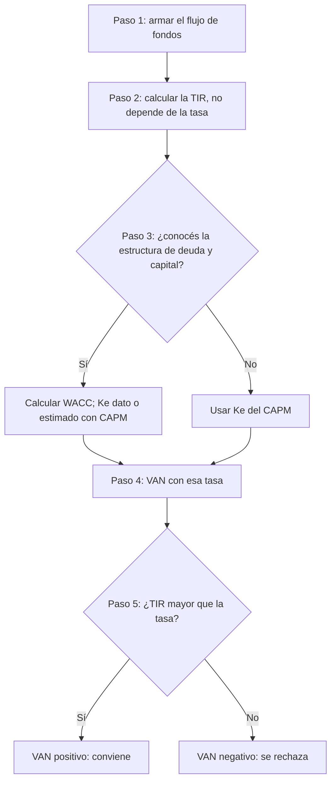

# WACC vs. CAPM

> [!abstract] En una frase
> WACC y CAPM no compiten: el **CAPM estima lo que exigen los accionistas** ($K_e$)
> y el **WACC lo mezcla con el costo de la deuda**. Cuál usar depende de si conocés
> la estructura de financiamiento.

**Prerrequisitos:** [[wacc]] y [[capm]].
**Sigue con:** [[ejercicios-wacc-capm]], para practicar el integrador.

---

## El círculo se cierra

La fórmula del [[valor-actual-neto]] tiene una $i$ en el denominador. Todo el
bloque de [[tasa-de-descuento]] responde qué poner ahí:

- **[[wacc]]** si se conoce la estructura real de financiamiento de la firma.
- **$E(r_i)$ del [[capm]]** (o $K_e$) si hay que estimar el costo de los fondos
  propios comparando con el mercado.

> [!example] Analogía: la receta y el ingrediente
> - El **WACC** es la **receta**: mezcla dos ingredientes (deuda y capital propio)
>   en ciertas proporciones.
> - El **CAPM** es cómo conseguir **uno de los ingredientes** ($K_e$) cuando no lo
>   tenés en la alacena.
>
> Si la receta no se puede armar (no conocés $D$ y $PN$), podés usar solo el
> ingrediente: descontar con $K_e$.

---

## Comparación

| | [[wacc]] | [[capm]] |
|---|---|---|
| Qué calcula | Costo promedio de **toda** la financiación | Costo del **capital propio** ($K_e$) |
| Qué pondera | Deuda ($K_p$) **junto con** capital propio ($K_e$) | Solo el capital propio |
| Datos que necesita | $D$, $PN$, $K_d$, $t$, $K_e$ | $r_f$, $E(r_m)$, $\beta$, $RP$ |
| Óptica | La empresa (acreedores y accionistas) | El accionista |
| Cuándo usarlo | Es la tasa **más precisa** si se conoce la estructura de deuda | Mejor aproximación si no hay datos de deuda, o desde la óptica del accionista |

**Similitudes:** los dos son métodos objetivos para fijar la [[trema]] y los dos
terminan como la $i$ del VAN.

**Diferencia clave:** el WACC incluye la deuda (más barata, con escudo fiscal) y el
CAPM no. Por eso, si $K_p < K_e$, **el WACC queda por debajo del $K_e$ con el que
se calculó**.

> [!warning] Ojo con el caso de la clase
> Abajo el WACC ($15{,}8\%$) da **más** que el CAPM ($14{,}56\%$). No contradice lo
> anterior: ese WACC parte de un $K_e = 27\%$ asumido, no del $14{,}56\%$ estimado
> por CAPM. Son dos casos con datos distintos.

> [!tip] No son excluyentes
> En la práctica el CAPM calcula el $K_e$ que después **entra** en la fórmula del
> WACC.

---

## El flujo de trabajo completo

1. **Flujos de fondos:** armar el [[flujo-de-fondos]], con inversión inicial e
   ingresos futuros.
2. **TIR:** calcular la [[tasa-interna-de-retorno]]. Es propiedad fija del proyecto.
3. **Tasa de descuento:** WACC (si se conoce la estructura) o CAPM (si hay que
   estimar $K_e$).
4. **VAN:** descontar los mismos flujos con esa tasa.
5. **Comparación:** si $TIR >$ tasa, el VAN es positivo y conviene; si no, se
   rechaza.

## Aplicado al caso de la clase

Inversión $\$10.000$; flujos $\$2.500$, $\$5.000$, $\$7.000$;
$TIR \approx 18\%$ ($17{,}84\%$).

| | Con WACC | Con CAPM |
|---|---|---|
| Tasa | $15{,}8\%$ | $14{,}56\%$ |
| VAN (cálculo propio) | $+\$395$ | $+\$648$ |
| ¿Conviene? | ✅ Sí | ✅ Sí, con más margen |
| Por qué | La TIR supera la tasa | La TIR supera la tasa por más diferencia |

---

## Por qué importa de dónde sale la tasa

La conclusión **puede cambiar según la tasa elegida**. No alcanza con saber
calcular VAN y TIR: hay que **justificar el origen** de la tasa.

**Ejercicio integrador** (misma empresa de software: $D = 30\%$, $PN = 70\%$,
$T_p = 18\%$, $t = 35\%$, entonces $K_p = 11{,}7\%$):

| $K_e$ | Origen | WACC resultante |
|---|---|---|
| $24\%$ | Asumido en el enunciado | $20{,}31\%$ |
| $13{,}90\%$ | CAPM ($r_f = 4{,}3\%$, $E(r_m) = 8{,}5\%$, $\beta = 1{,}12$, $RP = 4{,}9\%$) | $13{,}24\%$ |

> [!warning] 7 puntos de diferencia sobre la misma empresa
> Solo por cambiar de dónde sale el $K_e$. Si el WACC recalculado y el original
> quedan parecidos, el $K_e$ asumido era razonable. Si quedan muy distintos, es la
> evidencia de **cuánto puede cambiar una decisión** según el origen de la tasa. Un
> proyecto con $TIR = 16\%$ se rechazaría con el primer WACC y se aceptaría con el
> segundo.

---

## Errores comunes

| Error | Lo correcto |
|---|---|
| "WACC o CAPM, elijo uno al azar." | Depende de si hay datos de la estructura de deuda. |
| Usar el WACC y el CAPM como si midieran lo mismo. | El CAPM mide solo el capital propio; el WACC, toda la financiación. |
| Recalcular la TIR al cambiar de tasa. | La TIR no cambia; cambia el VAN. |

---

## Autoevaluación

1. Te dan $r_f$, $E(r_m)$, $\beta$ y $RP$, pero nada sobre la deuda de la empresa.
   ¿Qué tasa usás?
   > [!question]- Respuesta
   > El $E(r_i)$ del **CAPM** como tasa de descuento. Sin $D$, $PN$ y $K_d$ no se
   > puede armar el WACC.

2. Te dan $D$, $PN$, $K_d$, $t$ y los datos del CAPM. ¿Qué hacés?
   > [!question]- Respuesta
   > Calculás $K_e$ con el CAPM, $K_p$ con el escudo fiscal y los combinás en el
   > **WACC**, que es la tasa más precisa.

3. En el integrador, ¿qué proyecto conviene con un WACC y no con el otro?
   > [!question]- Respuesta
   > Cualquier proyecto con TIR entre $13{,}24\%$ y $20{,}31\%$: se acepta con el
   > WACC basado en CAPM y se rechaza con el basado en el $K_e$ asumido.

---

## Relacionado

- [[wacc]] y [[capm]]: los dos métodos.
- [[trema]]: el concepto que ambos calculan.
- [[tasa-de-descuento]]: el mapa del bloque.
- [[ejercicios-wacc-capm]]: integradores resueltos.
