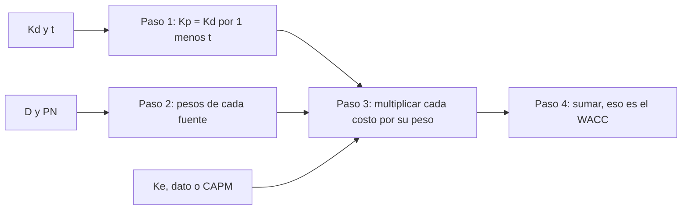

# WACC

> [!abstract] En una frase
> El WACC es el **costo promedio de la plata de la empresa**: mezcla lo que cuesta
> la deuda (después de impuestos) y lo que exigen los accionistas, cada uno según
> cuánto financia.

**Prerrequisitos:** [[ecuacion-contable-fundamental]] (los pesos) y [[escudo-fiscal]] ($K_p$).
**Sigue con:** [[capm]], cómo estimar $K_e$ cuando no es dato.

---

## El problema que resuelve

Una empresa se financia con **dos fuentes** que cuestan distinto: acreedores
(deuda) y accionistas (capital propio). Un proyecto tiene que rendir lo suficiente
para **satisfacer a los dos**. ¿Cuánto es eso?

## Intuición

> [!example] Analogía: la nota final ponderada
> Tu nota final es $80\%$ parcial y $20\%$ trabajo práctico. Sacaste $13$ en el
> parcial y $27$ en el TP (en una escala imaginaria).
>
> $$\text{Nota} = 0{,}80 \times 13 + 0{,}20 \times 27 = 10{,}4 + 5{,}4 = 15{,}8$$
>
> - Parcial = deuda (pesa $80\%$, "nota" $K_p = 13\%$)
> - TP = capital propio (pesa $20\%$, "nota" $K_e = 27\%$)
> - Nota final = WACC $= 15{,}8\%$
>
> No es el promedio simple ($20\%$): lo que más pesa arrastra el resultado.

---

## Fórmula

$$
WACC = \frac{D}{D + PN}\cdot K_p \;+\; \frac{PN}{D + PN}\cdot K_e
\qquad\text{con}\qquad
K_p = K_d\,(1-t)
$$

| Variable | Significado |
|---|---|
| $K_e$ (o $K$) | Costo de los fondos propios, exigido por los accionistas |
| $K_d$ (o $T_p$) | Costo de la deuda antes de impuestos |
| $K_p$ | Costo de la deuda después de impuestos ([[escudo-fiscal]]) |
| $t$ (o $T_{iigg}$) | Tasa efectiva de impuesto a las ganancias |
| $E$ o $PN$ | Patrimonio neto, capital propio |
| $D$ | Deuda financiera |

## Procedimiento



---

## Cálculo paso a paso

**Caso de la clase:** activo $\$100$ con $D = \$80$ y $PN = \$20$; $K_e = 27\%$,
$K_d = 20\%$, $t = 35\%$.

**1. Costo de la deuda neto de impuestos**

$$K_p = 20\% \times (1 - 0{,}35) = 13\%$$

**2. y 3. Ponderación de cada fuente**

$$\text{Deuda ponderada} = \tfrac{80}{100} \times 13\% = 10{,}4\%$$
$$\text{Capital ponderado} = \tfrac{20}{100} \times 27\% = 5{,}4\%$$

**4. Suma**

$$WACC = 10{,}4\% + 5{,}4\% = \mathbf{15{,}8\%}$$

**Interpretación:** es la tasa de descuento que la empresa debe usar para evaluar
sus proyectos, **siempre que mantenga esta relación entre deuda y capital
propio**.

---

## Sensibilidad al apalancamiento

Con $K_e = 27\%$ y $K_p = 13\%$ fijos, variando el peso de la deuda:

| % Deuda | 0% | 20% | 50% | 80% | 100% |
|---|---|---|---|---|---|
| **WACC** | $27{,}0\%$ | $24{,}2\%$ | $20{,}0\%$ | $15{,}8\%$ | $13{,}0\%$ |

```
WACC
27% ●  <- todo capital propio (WACC = Ke)
    │   ●
    │       ●
    │           ●
13% │               ●  <- todo deuda (WACC = Kp)
    └───────────────────── % deuda
    0%  20%  50%  80% 100%
```

El WACC siempre queda **entre $K_p$ y $K_e$**. Acá más deuda lo baja porque
$K_p < K_e$: la deuda no es gratis, pero es más barata que el capital propio, por
la tasa de mercado y por el escudo fiscal.

---

## Tres ideas que dejan los ejercicios

> [!tip] 1. $K_p$ no es $K_d$
> La diferencia es el [[escudo-fiscal]]. Subir el impuesto **baja** el costo de la
> deuda.

> [!tip] 2. Un peso extremo domina la fórmula
> Con $D = 95\%$, subir $K_e$ de $27\%$ a $50\%$ (23 puntos) mueve el WACC apenas
> $1{,}15$ puntos: de $13{,}7\%$ a $14{,}85\%$. El capital propio pesa $5\%$, así
> que casi no importa cuánto cueste.

> [!tip] 3. A igualdad de pesos, gana la tasa más alta
> Con $50/50$, $K_e = 30\%$ y $K_p = 11{,}7\%$, el capital ponderado ($15\%$)
> **casi triplica** al de la deuda ($5{,}85\%$). Si los pesos son iguales, la
> diferencia la hace la tasa.

## Limitación

Para calcularlo es **indispensable conocer la estructura real** de deuda y
capital. Si no está definida, o si $K_e$ no es dato, hay que estimarlo con el
[[capm]].

---

## Errores comunes

| Error | Lo correcto |
|---|---|
| Usar $K_d$ en lugar de $K_p$. | Aplicar primero el escudo fiscal. |
| Promedio simple de las tasas. | Ponderar por $D/(D+PN)$ y $PN/(D+PN)$. |
| Usar montos ($80$, $20$) como pesos. | Los pesos son **proporciones**: $0{,}80$ y $0{,}20$. |
| Aplicar $(1-t)$ a $K_e$. | Solo la deuda tiene escudo fiscal. |
| Obtener un WACC fuera del rango $[K_p, K_e]$. | Imposible: revisá las cuentas. |

---

## Autoevaluación

1. $D = PN = \$50$, $K_e = 30\%$, $K_d = 18\%$, $t = 35\%$. ¿WACC?
   > [!question]- Respuesta
   > $K_p = 18\% \times 0{,}65 = 11{,}7\%$.
   > $WACC = 0{,}5 \times 11{,}7\% + 0{,}5 \times 30\% = 5{,}85\% + 15\% = 20{,}85\%$.

2. Empresa de software: $D = 30\%$, $PN = 70\%$, $K_e = 24\%$, $T_p = 18\%$,
   $T_{iigg} = 35\%$. ¿WACC?
   > [!question]- Respuesta
   > $K_p = 18\% \times 0{,}65 = 11{,}7\%$.
   > $WACC = 0{,}30 \times 11{,}7\% + 0{,}70 \times 24\% = 3{,}51\% + 16{,}8\% = 20{,}31\%$.

3. Si una empresa financiada solo con capital propio empieza a tomar deuda más
   barata que $K_e$, ¿qué le pasa al WACC?
   > [!question]- Respuesta
   > **Baja**, porque una parte del financiamiento pasa a costar $K_p < K_e$. En el
   > caso límite de $100\%$ deuda, $WACC = K_p$.

---

## Relacionado

- [[escudo-fiscal]]: el paso 1.
- [[ecuacion-contable-fundamental]]: de dónde salen los pesos.
- [[capm]]: cómo estimar $K_e$.
- [[wacc-vs-capm]]: cuándo usar cada uno.
- [[ejercicios-wacc-capm]]: los seis ejercicios resueltos.
