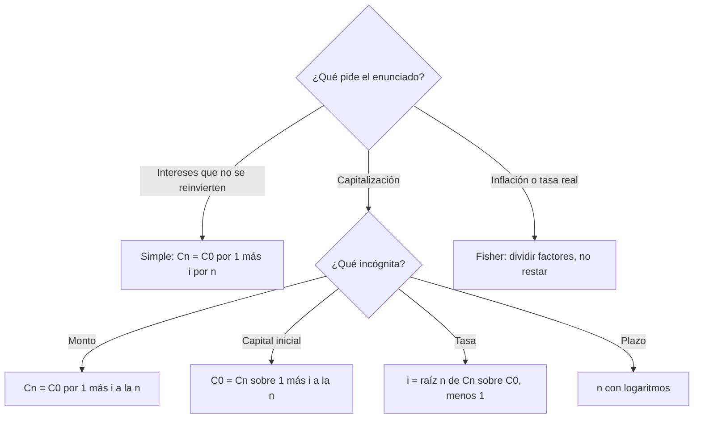

# Ejercicios: interés e inflación

> [!abstract] Cómo usar esta página
> Leé el enunciado, resolvelo en papel y **recién después** abrí la solución.
> Parte A tiene la resolución oficial de la cátedra; Parte B tiene una resolución
> propia (no oficial), porque `raw/` no trae soluciones.

**Teoría:** [[interes-simple]], [[interes-compuesto]], [[ecuacion-de-fisher]],
[[tasa-de-interes]].

---

## Estrategia: ¿qué fórmula uso?

> [!warning] Chequeos antes de calcular
> 1. ¿Tasa y plazo están en la **misma unidad**?
> 2. ¿La tasa está en **decimal**?
> 3. ¿Es simple o compuesto?
> 4. Si hay inflación: ¿estoy **dividiendo** factores?

---

## Parte A: resueltos en clase (solución oficial)

### A1 · Simple vs. compuesto

$C_0 = \$5.000$, $i = 6\%$ anual, $n = 4$ años. Calcular monto e interés con
ambos regímenes.

> [!question]- Solución
> | Régimen | Monto | Interés |
> |---|---|---|
> | Simple: $5.000 \times (1 + 0{,}06 \times 4)$ | $\$6.200$ | $\$1.200$ |
> | Compuesto: $5.000 \times (1{,}06)^4$ | $\$6.312{,}38$ | $\$1.312{,}38$ |
>
> El compuesto genera $\$112{,}38$ más porque los intereses de cada año generan
> nuevos intereses.

### A2 · Despejar el capital inicial

¿Cuánto invertir hoy al $8\%$ compuesto para tener $\$50.000$ en 6 años?

> [!question]- Solución
> $$C_0 = \frac{50.000}{(1{,}08)^6} = \frac{50.000}{1{,}586874} \approx \$31.508{,}49$$
> Verificación: $31.508{,}49 \times 1{,}586874 \approx \$50.000$. ✓

### A3 · Punto de equilibrio entre regímenes

$C_0 = \$20.000$ a 3 años. **A:** simple $12\%$. **B:** compuesto $9\%$. ¿Cuál
conviene? ¿A partir de qué plazo cambia?

> [!question]- Solución
> - A: $20.000 \times 1{,}36 = \$27.200$
> - B: $20.000 \times (1{,}09)^3 = \$25.900{,}58$
>
> A los 3 años conviene **A**. Comparando $(1{,}09)^n$ contra $1 + 0{,}12n$:
>
> | $n$ | B: $(1{,}09)^n$ | A: $1+0{,}12n$ | Gana |
> |---|---|---|---|
> | 5 | $1{,}5386$ | $1{,}60$ | A |
> | 7 | $1{,}8280$ | $1{,}84$ | A, por poco |
> | 8 | $1{,}9926$ | $1{,}96$ | **B** |
>
> B supera a A entre los **7 y 8 años**. Con una tasa más baja, la capitalización
> termina ganando si el plazo es suficientemente largo.

### A4 · Tasa real con Fisher

Nominal $35\%$, inflación $28\%$. ¿Tasa real?

> [!question]- Solución
> $$i_R = \frac{1{,}35}{1{,}28} - 1 = 5{,}47\%$$
> **Ganó** poder de compra, pero poco: la inflación absorbió la mayor parte de los
> 35 puntos nominales.

### A5 · Despejar la tasa nominal

¿Qué nominal hace falta para obtener $5\%$ real con inflación del $15\%$?

> [!question]- Solución
> $$i_A = 1{,}15 \times 1{,}05 - 1 = 20{,}75\%$$

### A6 · Tres escenarios de inflación

$\$100.000$ a una tasa nominal fija del $22\%$. Calcular la tasa real con
inflación del $10\%$, $20\%$ y $30\%$.

> [!question]- Solución
> | $\pi$ | $i_R = 1{,}22/(1+\pi) - 1$ | Lectura |
> |---|---|---|
> | $10\%$ | $10{,}91\%$ | Gana poder de compra |
> | $20\%$ | $1{,}67\%$ | Real positiva pero casi nula |
> | $30\%$ | $-6{,}15\%$ | **Pierde** poder de compra |
>
> **Punto de quiebre:** $i_R = 0$ cuando $\pi = i_A = 22\%$.

---

## Parte B: guía de repaso (resolución propia, no oficial)

De `EPT_Clase2_EjerciciosRepaso.pdf`. Las soluciones las calculé yo; verificalas
contra lo que resuelva la cátedra.

**B1.** $\$8.000$ a **interés simple** durante **18 meses** al $14\%$ anual.
Interés y monto final.

> [!question]- Solución
> $n = 1{,}5$ años. $I = 8.000 \times 0{,}14 \times 1{,}5 = \$1.680$.
> $C_n = \$9.680$.

**B2.** $\$12.000$ a interés compuesto, 5 años, $7\%$ anual. Monto e interés.

> [!question]- Solución
> $C_5 = 12.000 \times 1{,}07^5 = \$16.830{,}62$. $I = \$4.830{,}62$.

**B3.** $\$15.000$ se convirtieron en $\$21.000$ en 4 años de capitalización
compuesta. ¿Tasa anual?

> [!question]- Solución
> $i = (21.000/15.000)^{1/4} - 1 = 8{,}78\%$ anual.

**B4.** ¿Cuántos años para que $\$10.000$ se conviertan en $\$25.000$ al $11\%$
compuesto?

> [!question]- Solución
> $n = \dfrac{\ln 25.000 - \ln 10.000}{\ln 1{,}11} = 8{,}78$ años (unos 8 años y
> 9 meses).

**B5.** $\$30.000$ a 2 años: **A** simple $18\%$ vs. **B** compuesto $15\%$. ¿Cuál
conviene?

> [!question]- Solución
> A: $30.000 \times 1{,}36 = \$40.800$. B: $30.000 \times 1{,}15^2 = \$39.675$.
> **Conviene A** a 2 años.

**B6.** Alternativa segura al $9\%$. Un proyecto de riesgo similar devuelve
$\$54.500$ en un año por $\$50.000$ hoy. ¿Tasa y decisión?

> [!question]- Solución
> $i = 54.500/50.000 - 1 = 9\%$. Igual al costo de oportunidad: **indiferente**.
> No crea valor adicional frente a la alternativa segura.

**B7.** Plazo fijo nominal $60\%$, inflación $45\%$. Tasa real: ¿ganó o perdió
poder de compra?

> [!question]- Solución
> $i_R = 1{,}60/1{,}45 - 1 = 10{,}34\%$. **Ganó** poder de compra. La resta
> ($15\%$) lo habría sobreestimado en casi 5 puntos.

**B8.** Nominal $40\%$, real $8\%$. Despejar la inflación.

> [!question]- Solución
> $\pi = 1{,}40/1{,}08 - 1 = 29{,}63\%$.

**B9.** Bono nominal $6\%$ con **deflación** del $3\%$. Tasa real y por qué no es
la simple diferencia.

> [!question]- Solución
> $i_R = 1{,}06/0{,}97 - 1 = 9{,}28\%$. La diferencia simple daría $9\%$. La
> relación es multiplicativa: la baja de precios también aumenta el poder de compra
> de los intereses ganados, no solo del capital.

**B10.** $\$40.000$ al $30\%$ nominal compuesto por 2 años, con inflación acumulada
del $22\%$ en el bienio. (a) Monto nominal. (b) Tasa real anual equivalente.
(c) ¿Mantuvo el poder de compra?

> [!question]- Solución
> **(a)** $C_2 = 40.000 \times 1{,}30^2 = \$67.600$.
>
> **(b)** Hay que poner la inflación en la misma unidad que la tasa (anual):
> $$\pi_{anual} = 1{,}22^{1/2} - 1 = 10{,}45\%$$
> $$i_R = \frac{1{,}30}{1{,}1045} - 1 = 17{,}70\% \text{ anual}$$
> Verificación por el bienio: $1{,}69/1{,}22 - 1 = 38{,}52\%$ real acumulado, y
> $1{,}177^2 \approx 1{,}385$. ✓
>
> **(c)** Sí, y lo mejoró: para mantener el poder de compra alcanzaba con
> $40.000 \times 1{,}22 = \$48.800$, y se obtuvieron $\$67.600$.

---

## Relacionado

- [[parciales-y-practica]]: calendario y qué entra en cada parcial.
- [[repaso-primer-parcial]]: hoja de fórmulas y errores típicos.
- [[ejercicios-van-tir]]: siguiente guía de práctica.
