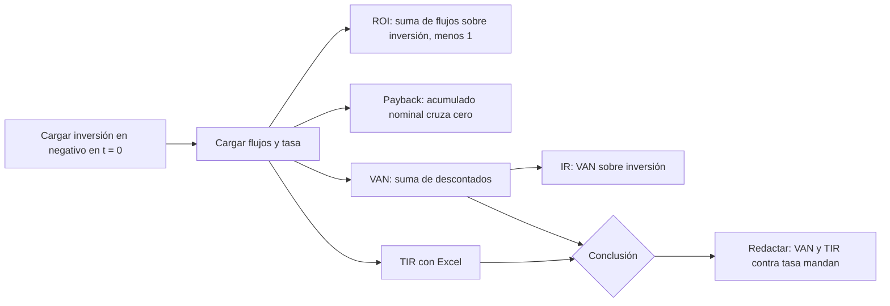

# Ejercicios: VAN, IR y TIR

> [!abstract] Cómo usar esta página
> Todos se resuelven con la misma plantilla de [[flujo-de-fondos]]: cargar
> inversión y tasa, completar los flujos, leer los resultados. Resolvé primero y
> abrí la solución después. Parte A es oficial; Parte B es resolución propia.

**Teoría:** [[roi-y-roa]], [[payback]], [[valor-actual-neto]],
[[indice-de-rentabilidad]], [[tasa-interna-de-retorno]].

---

## Estrategia: los cinco resultados en orden

> [!tip] Cómo redactar la conclusión
> "El proyecto **[sí / no] conviene**: el VAN es **[positivo / negativo]** ($\$X$) y
> la TIR ($Y\%$) es **[mayor / menor]** que la tasa exigida ($Z\%$). [Si ROI o
> payback sugieren otra cosa, aclarar que no consideran el valor tiempo del
> dinero.]"

---

## Parte A: resueltos (libro de soluciones oficial)

### A1 · Integrador: los cinco indicadores

Inversión $\$18.000$; flujos $\$5.000$, $\$6.000$, $\$6.000$, $\$7.000$; tasa
$15\%$.

> [!question]- Solución
> | Indicador | Resultado |
> |---|---|
> | ROI | $33{,}33\%$ |
> | Repago simple | $3{,}14$ años |
> | VAN | $-\$1.167{,}94$ |
> | IR | $-6{,}49\%$ |
> | TIR | $11{,}92\%$ |
> | Repago descontado | No se recupera en el horizonte |
>
> **El proyecto NO conviene.** ROI y repago simple parecen razonables, pero el VAN
> es negativo y la TIR queda por debajo del $15\%$: el proyecto destruye valor. Es
> el ejemplo canónico de [[tecnicas-de-evaluacion-de-proyectos]].

### A2 · ROI y repago simple

Inversión $\$25.000$; flujos $\$8.000$, $\$8.000$, $\$9.000$, $\$9.000$. Sin tasa.

> [!question]- Solución
> $$ROI = \frac{34.000}{25.000} - 1 = 36\% \qquad \text{Repago} = 3 \text{ años exactos}$$
> El acumulado llega a $0$ justo al cierre del año 3.

### A3 · VAN e IR

Inversión $\$15.000$; flujos $\$4.000$, $\$5.000$, $\$5.000$, $\$6.000$, $\$6.000$;
tasa $12\%$.

> [!question]- Solución
> $$VAN = \$3.333{,}97 \qquad IR = 22{,}23\%$$
> VAN e IR positivos: **conviene** al $12\%$.

### A4 · TIR vs. tasa exigida

Inversión $\$20.000$; flujos $\$7.000$ anuales por 4 años; tasa exigida $18\%$.

> [!question]- Solución
> $$TIR = 14{,}96\% \qquad VAN_{18\%} = -\$1.169{,}57$$
> TIR menor que la tasa exigida: **no conviene**, y el VAN negativo lo confirma.

---

## Parte B: tarea para casa, 10 casos de IT (resolución propia, no oficial)

Todos piden una **conclusión redactada**, no solo el número.

| # | Caso | Inversión | Flujos | Tasa | Pide |
|---|---|---|---|---|---|
| 1 | Bot de RPA para facturación | $\$14.000$ | $\$6.000 \times 3$ | | ROI, repago |
| 2 | Suscripción premium en una app | $\$22.000$ | $7.000$ / $8.000$ / $9.000$ | $10\%$ | VAN y riesgo de los supuestos de ingresos |
| 3 | Dashboard interno de analítica | $\$16.000$ | $5.000$ / $6.000$ / $6.000$ / $6.000$ | $13\%$ | VAN, IR |
| 4 | Software de optimización de rutas | $\$28.000$ | $\$9.000 \times 4$ | $16\%$ | TIR y margen de error si el ahorro fuera $15\%$ menor |
| 5 | Notebook y licencias (freelance) | $\$10.000$ | $2.000$ / $3.000$ / $4.000$ / $6.000$ | $11\%$ | ROI, repago, VAN y por qué ROI y repago pueden engañar |
| 6 | Migración a cloud | $\$35.000$ | $\$12.000 \times 3$ | $9\%$ | VAN, IR, TIR |
| 7 | SaaS de gestión de pacientes | $\$18.500$ | $\$5.500 \times 5$ | $20\%$ | TIR y si es razonable exigir $20\%$ a un ahorro predecible |
| 8 | Punto de venta e inventario | $\$9.000$ | $\$3.500 \times 3$ | $8\%$ | Los cinco indicadores y su comparación |
| 9 | WMS para depósito | $\$40.000$ | $11.000$ / $12.000$ / $13.000$ / $14.000$ | $15\%$ | VAN, IR, TIR y cuándo darían señales distintas |
| 10 | Chatbot (X) vs. motor de recomendaciones (Y) | $\$20.000$ | X: $\$8.000 \times 3$; Y: $4.000$ / $8.000$ / $14.000$ | $10\%$ | VAN y TIR de cada uno, recomendación con aversión al riesgo |

### Soluciones

> [!question]- B1 · Bot de RPA
> $ROI = 18.000/14.000 - 1 = 28{,}57\%$.
> Acumulado: $-14.000$, $-8.000$, $-2.000$, $+4.000$. Repago $= 2 + 2.000/6.000 = 2{,}33$ años.
> **Conclusión:** se recupera antes del tercer año y rinde $28{,}6\%$ nominal. Sin
> tasa no se puede afirmar que cree valor.

> [!question]- B2 · Suscripción premium
> $VAN_{10\%} = -\$2.262{,}96$ (TIR $4{,}29\%$). **No conviene.**
> **Riesgo de los supuestos:** los ingresos por suscripción dependen de la
> adopción. Si fueran menores a lo proyectado, el VAN sería todavía más negativo;
> el proyecto ya no conviene con los supuestos optimistas.

> [!question]- B3 · Dashboard de analítica
> $VAN_{13\%} = \$961{,}87$. $IR = 961{,}87/16.000 = 6{,}01\%$. **Conviene**, con un
> margen moderado (TIR $15{,}78\%$).

> [!question]- B4 · Optimización de rutas
> $TIR = 10{,}87\%$, menor que $16\%$: **no conviene** ($VAN = -\$2.816{,}37$).
> **Si el ahorro fuera $15\%$ menor** ($\$7.650$ anuales): $TIR = 3{,}65\%$,
> $VAN = -\$6.593{,}92$. No hay margen de error: ya con el ahorro estimado no
> alcanza la tasa exigida.

> [!question]- B5 · Notebook y licencias
> $ROI = 15.000/10.000 - 1 = 50\%$. Repago $= 3 + 1.000/6.000 = 3{,}17$ años.
> $VAN_{11\%} = \$1.113{,}82$ (TIR $15{,}28\%$). **Conviene.**
> **Por qué ROI y repago pueden engañar:** el ROI trata igual los $\$2.000$ del año 1
> y los $\$6.000$ del año 4. Acá los flujos crecen, así que buena parte del retorno
> llega tarde y vale menos: el repago descontado es $3{,}72$ años, no $3{,}17$.
> En este caso la conclusión coincide, pero con una tasa más alta podría no
> coincidir.

> [!question]- B6 · Migración a cloud
> $VAN_{9\%} = -\$4.624{,}46$; $IR = -13{,}21\%$; $TIR = 1{,}42\%$. **No conviene.**
> Los flujos nominales ($\$36.000$) apenas superan la inversión.

> [!question]- B7 · SaaS de pacientes
> $TIR = 14{,}86\%$, menor que $20\%$: **no conviene** a esa tasa ($VAN = -\$2.051{,}63$).
> **¿Es razonable exigir $20\%$?** Si el ahorro es predecible, el riesgo es bajo y
> una tasa del $20\%$ parece excesiva. Con $12\%$, por ejemplo, el
> $VAN = +\$1.326{,}27$ y convendría: **la decisión depende de justificar la tasa**
> (ver [[tasa-de-descuento]]).

> [!question]- B8 · Punto de venta
> | Indicador | Resultado |
> |---|---|
> | ROI | $16{,}67\%$ |
> | Repago simple | $2{,}57$ años |
> | Repago descontado | $2{,}99$ años |
> | VAN al $8\%$ | $\$19{,}84$ |
> | IR | $0{,}22\%$ |
> | TIR | $8{,}12\%$ |
>
> **Conviene, pero en el límite.** VAN casi cero y TIR apenas encima del $8\%$. El
> repago descontado se completa justo antes de terminar el horizonte. Cualquier
> desvío en los flujos lo vuelve negativo.

> [!question]- B9 · WMS para depósito
> $VAN_{15\%} = -\$4.808{,}80$; $IR = -12{,}02\%$; $TIR = 9{,}16\%$. **No conviene.**
> **¿Cuándo darían señales distintas?** Para un solo proyecto convencional nunca.
> Pueden diferir al **comparar proyectos de distinta escala** (VAN en pesos contra
> TIR e IR relativos) o si los flujos **cambian de signo más de una vez** (varias
> TIR).

> [!question]- B10 · Chatbot (X) vs. recomendaciones (Y)
> | | X: chatbot | Y: recomendaciones |
> |---|---|---|
> | VAN al $10\%$ | $-\$105{,}18$ | $+\$766{,}34$ |
> | TIR | $9{,}70\%$ | $11{,}79\%$ |
> | Origen del flujo | Ahorro operativo, predecible | Ventas crecientes, incierto |
>
> **Por números, Y.** X ni siquiera alcanza el $10\%$.
> **Con aversión al riesgo:** Y depende de una proyección de ventas crecientes y
> concentra el flujo en el año 3. Una respuesta sólida: Y conviene **solo si** su
> mayor riesgo se refleja con una tasa más alta y aun así el VAN sigue positivo. Su
> TIR es $11{,}79\%$, así que con una tasa de $12\%$ o más ya no convendría. X es
> más predecible, pero a la tasa dada destruye valor (poco), así que tampoco es una
> alternativa automática.

---

## Relacionado

- [[flujo-de-fondos]]: la plantilla.
- [[tecnicas-de-evaluacion-de-proyectos]]: por qué VAN y TIR mandan.
- [[repaso-primer-parcial]]: fórmulas y errores típicos.
- [[parciales-y-practica]]: calendario.
