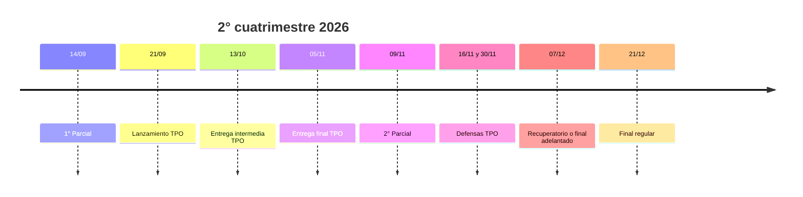

# Parciales, TPO y práctica

> [!abstract] En una frase
> Fechas de evaluación y entregas del cuatrimestre, qué entra en cada parcial y con
> qué página practicarlo. El detalle clase por clase está en [[programa-del-curso]].

---

## Línea de tiempo

## Calendario de evaluaciones

| Fecha | Instancia |
|---|---|
| **14/09** | **1° Parcial** (clase 7) |
| 21/09 | Lanzamiento del TPO |
| **13/10 (martes)** | **Entrega Intermedia TPO** |
| **05/11 (jueves)** | **Entrega Final TPO** |
| **09/11** | **2° Parcial** (clase 14) |
| 16/11 | Defensa TPO: grupos 1, 2, 3 y 4 |
| 30/11 | Defensa TPO: grupos 5, 6, 7 y 8 |
| **07/12** | **Recuperatorio / Final adelantado** |
| **21/12** | **Final regular** |

---

## Qué entra en el 1° Parcial (14/09)

Todo lo dado hasta la clase 6 inclusive.

> [!tip] Repaso de último momento
> [[repaso-primer-parcial]] junta todas las fórmulas, reglas de decisión, los 12
> errores más comunes y un simulacro con respuestas.

| Bloque | Clases | Páginas | Práctica |
|---|---|---|---|
| **Matemática Financiera I** | 2 y 3 | [[valor-tiempo-del-dinero]], [[tasa-de-interes]], [[interes-simple]], [[interes-compuesto]], [[ecuacion-de-fisher]] | [[ejercicios-interes-e-inflacion]] |
| **Matemática Financiera II** | 4 | [[tecnicas-de-evaluacion-de-proyectos]], [[flujo-de-fondos]], [[roi-y-roa]], [[payback]], [[valor-actual-neto]], [[indice-de-rentabilidad]], [[tasa-interna-de-retorno]] | [[ejercicios-van-tir]] |
| **Matemática Financiera III** | 5 | [[tasa-de-descuento]], [[tasa-libre-de-riesgo]], [[trema]], [[escudo-fiscal]], [[wacc]], [[capm]], [[beta]], [[riesgo-pais]], [[wacc-vs-capm]] | [[ejercicios-wacc-capm]] |
| **Contabilidad tradicional** | 6 | [[ecuacion-contable-fundamental]] | |

## Plan de estudio sugerido

- [ ] **Leer el "En una frase"** de cada página del bloque: si alguna no se entiende, abrir la página completa.
- [ ] **Resolver** la Parte A de las tres guías sin mirar las soluciones.
- [ ] **Repasar** la tabla de errores comunes de [[repaso-primer-parcial]].
- [ ] **Hacer** el simulacro de [[repaso-primer-parcial]].
- [ ] **Practicar redacción** de conclusiones con la Parte B de [[ejercicios-van-tir]].

---

## Guías de práctica

- [[ejercicios-interes-e-inflacion]]: Clase 2. Interés simple y compuesto, tasa real y Fisher.
- [[ejercicios-van-tir]]: Clases 3 y 4. Flujo de fondos, ROI, payback, VAN, IR y TIR.
- [[ejercicios-wacc-capm]]: Clases 5 y 6. WACC, escudo fiscal, CAPM, beta y riesgo país.

## Relacionado

- [[programa-del-curso]]: cronograma completo.
- [[repaso-primer-parcial]]: hoja de repaso.
