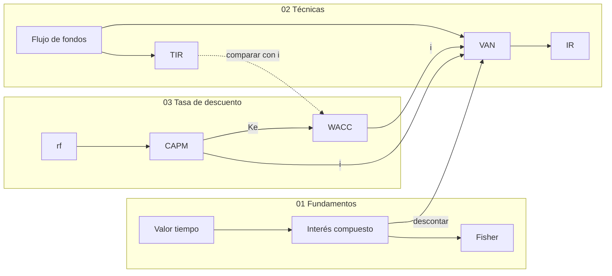

# Repaso para el 1° Parcial

> [!abstract] Para qué sirve
> Todo el contenido del 1° Parcial en una página: **fórmulas, reglas de decisión,
> errores típicos y un simulacro rápido**. Es para repasar, no para aprender desde
> cero; cada sección enlaza a la página completa.

---

## El mapa en una imagen

---

## Fórmulas

### 01 · Fundamentos

| Concepto | Fórmula | Página |
|---|---|---|
| Interés simple | $I = C_0\,i\,n$ y $C_n = C_0(1 + i\,n)$ | [[interes-simple]] |
| Interés compuesto | $C_n = C_0(1+i)^n$ | [[interes-compuesto]] |
| Capital inicial | $C_0 = C_n / (1+i)^n$ | [[interes-compuesto]] |
| Tasa | $i = (C_n/C_0)^{1/n} - 1$ | [[interes-compuesto]] |
| Plazo | $n = (\ln C_n - \ln C_0) / \ln(1+i)$ | [[interes-compuesto]] |
| Fisher | $(1+i_A) = (1+\pi)(1+i_R)$ | [[ecuacion-de-fisher]] |
| Tasa real | $i_R = (1+i_A)/(1+\pi) - 1$ | [[ecuacion-de-fisher]] |

### 02 · Técnicas

| Indicador | Fórmula | Regla | Página |
|---|---|---|---|
| ROI | $\sum FF_t / C_0 - 1$ | Mayor es mejor (no mira el tiempo) | [[roi-y-roa]] |
| ROA | $\text{Utilidad} / \text{Activo total}$ | | [[roi-y-roa]] |
| Payback | $t^{*} + \lvert\text{acum}_{t^{*}}\rvert / FF_{t^{*}+1}$ | Menor es más rápido | [[payback]] |
| VAN | $\sum_{t=0}^{n} FF_t / (1+i)^t$ | $VAN > 0$: conviene | [[valor-actual-neto]] |
| IR | $VAN / C_0$ | $IR > 0$: conviene (**umbral 0**) | [[indice-de-rentabilidad]] |
| TIR | $\sum_{t=0}^{n} FF_t / (1+TIR)^t = 0$ | $TIR > i$: conviene | [[tasa-interna-de-retorno]] |

### 03 · Tasa de descuento

| Concepto | Fórmula | Página |
|---|---|---|
| TREMA | $r_f + \text{ajuste por riesgo}$ | [[trema]] |
| Ecuación contable | $\text{Activo} = \text{Pasivo} + PN$ | [[ecuacion-contable-fundamental]] |
| Escudo fiscal | $K_p = K_d(1-t)$ | [[escudo-fiscal]] |
| WACC | $\frac{D}{D+PN}K_p + \frac{PN}{D+PN}K_e$ | [[wacc]] |
| CAPM | $E(r_i) = r_f + \beta[E(r_m) - r_f] + RP$ | [[capm]] |
| Puntos básicos | $100 \text{ pb} = 1\%$ | [[riesgo-pais]] |

---

## Reglas de decisión que tienen que salir de memoria

> [!success] Coherencia en un proyecto convencional
> $$VAN > 0 \iff IR > 0 \iff TIR > i$$

> [!success] Entre proyectos excluyentes
> Manda el **VAN**. Con presupuesto limitado, ordenar por **IR**.

> [!success] Qué tasa usar
> ¿Conocés $D$, $PN$ y $K_d$? Usá el **WACC**. Si no, el **$K_e$ del CAPM**.

---

## Los 12 errores que más cuestan puntos

| # | Error | Lo correcto | Página |
|---|---|---|---|
| 1 | Plazo en meses con tasa anual | Misma unidad | [[interes-simple]] |
| 2 | $i_R = i_A - \pi$ | Dividir factores | [[ecuacion-de-fisher]] |
| 3 | Olvidar el $-1$ en Fisher o al despejar $i$ | El cociente es un factor | [[ecuacion-de-fisher]] |
| 4 | Concluir solo con ROI o payback | VAN y TIR contra tasa mandan | [[tecnicas-de-evaluacion-de-proyectos]] |
| 5 | Inversión sin signo negativo en $t=0$ | Siempre negativa | [[flujo-de-fondos]] |
| 6 | "VAN negativo es pérdida" | Es rendir menos que la tasa | [[valor-actual-neto]] |
| 7 | IR con umbral 1 | Umbral 0 (definición de la cátedra) | [[indice-de-rentabilidad]] |
| 8 | "TIR de $18\%$, conviene" | Depende de la tasa exigida | [[tasa-interna-de-retorno]] |
| 9 | $K_d$ en el WACC | $K_p = K_d(1-t)$ | [[escudo-fiscal]] |
| 10 | "Más impuesto, deuda más cara" | Más impuesto, deuda más barata | [[escudo-fiscal]] |
| 11 | $\beta \times RP$ | RP se suma aparte | [[riesgo-pais]] |
| 12 | "Subir $r_f$ siempre sube el CAPM" | Con $\beta > 1$ lo baja | [[tasa-libre-de-riesgo]] |

---

## Simulacro rápido (resolvé sin mirar)

1. Nominal $30\%$, inflación $20\%$. ¿Tasa real?
   > [!question]- Respuesta
   > $1{,}30/1{,}20 - 1 = 8{,}33\%$.

2. ¿Cuánto vale hoy $\$1.331$ a cobrar en 3 años al $10\%$?
   > [!question]- Respuesta
   > $1.331 / 1{,}10^3 = 1.331/1{,}331 = \$1.000$.

3. Inversión $\$10.000$, flujos $\$3.000 \times 5$, tasa $10\%$. VAN, IR y payback simple.
   > [!question]- Respuesta
   > $VAN = \$1.372{,}36$; $IR = 13{,}72\%$; payback $= 3 + 1.000/3.000 = 3{,}33$ años.

4. Un proyecto tiene $TIR = 15{,}24\%$ y la empresa tiene $WACC = 15{,}8\%$. ¿Conviene?
   > [!question]- Respuesta
   > **No**: $TIR < WACC$, así que el VAN a esa tasa es negativo.

5. $D = 40$, $PN = 60$, $K_d = 20\%$, $t = 30\%$, $K_e = 22\%$. ¿WACC?
   > [!question]- Respuesta
   > $K_p = 20\% \times 0{,}70 = 14\%$.
   > $WACC = 0{,}40 \times 14\% + 0{,}60 \times 22\% = 5{,}6\% + 13{,}2\% = 18{,}8\%$.

6. $r_f = 4{,}72\%$, $E(r_m) = 9\%$, $\beta = 1{,}12$, $RP = 505$ pb. ¿$E(r_i)$?
   > [!question]- Respuesta
   > $4{,}72 + 1{,}12 \times 4{,}28 + 5{,}05 = 14{,}56\%$.

7. Con los datos anteriores, el riesgo país sube a 1.005 pb. ¿Nuevo $E(r_i)$?
   > [!question]- Respuesta
   > $+5$ puntos exactos: $19{,}56\%$. El RP no se multiplica por beta.

8. ROI $40\%$, payback 2,9 años, VAN $-\$1.170$. ¿Qué concluís?
   > [!question]- Respuesta
   > **No conviene.** El VAN negativo indica que rinde menos que la tasa exigida; ROI
   > y payback no consideran el valor tiempo del dinero ni el costo de capital.
   > Son los números del ejercicio A4 de [[ejercicios-van-tir]].

---

## Checklist del día del parcial

- [ ] Calculadora con $\ln$ y potencias fraccionarias.
- [ ] En cada ejercicio, anotar primero **datos e incógnita**.
- [ ] Tasas en decimal y en la misma unidad que el plazo.
- [ ] Toda conclusión **redactada**: decisión, indicador que la justifica y por qué.
- [ ] Si hay tasa de descuento: justificar **de dónde sale**.

---

## Relacionado

- [[parciales-y-practica]]: qué entra y cuándo.
- [[ejercicios-interes-e-inflacion]], [[ejercicios-van-tir]], [[ejercicios-wacc-capm]]: las tres guías de práctica.
