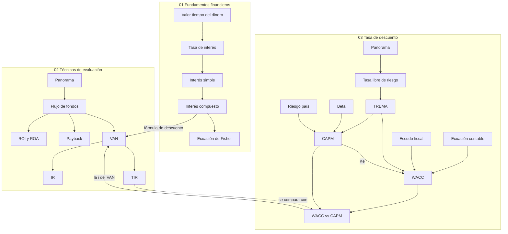

# Evaluación de Proyectos de Tecnología: índice

> [!abstract] De qué se trata
> Decidir si un proyecto de IT **conviene**. Para eso hace falta: (1) entender que
> el dinero vale distinto en el tiempo, (2) medir cuánto valor crea un proyecto y
> (3) saber contra qué tasa medirlo. UADE, código 3.4.139.

> [!tip] ¿Parcial cerca?
> Empezá por [[repaso-primer-parcial]]: fórmulas, errores típicos y simulacro.

---

## Mapa conceptual

---

## Ruta de estudio

Cada página tiene la misma estructura: **En una frase**, intuición con analogía,
fórmula explicada, ejemplo, errores comunes y autoevaluación con respuestas
plegables. Leelas en este orden:

### 01 · Fundamentos financieros

*El valor del dinero en el tiempo: la base de todo lo demás.*

1. [[valor-tiempo-del-dinero]]: por qué $\$1.000$ hoy valen más que mañana; los tres componentes de la tasa.
2. [[tasa-de-interes]]: el precio del dinero leído como costo de oportunidad, riesgo, herramienta y compensación.
3. [[interes-simple]]: $I = C_0\,i\,n$; los intereses van "al cajón" y crecen en línea recta.
4. [[interes-compuesto]]: $C_n = C_0(1+i)^n$; la bola de nieve y las cuatro fórmulas despejadas.
5. [[ecuacion-de-fisher]]: $(1+i_A) = (1+\pi)(1+i_R)$; contar changuitos, no pesos.

### 02 · Técnicas de evaluación

*Los cinco indicadores que deciden si un proyecto conviene.*

1. [[tecnicas-de-evaluacion-de-proyectos]]: enfoque contable vs. financiero y comparación de indicadores.
2. [[flujo-de-fondos]]: la planilla de la que salen todos los resultados, con un ejemplo completo.
3. [[roi-y-roa]]: rendimiento contable; no ve el calendario.
4. [[payback]]: período de repago simple y descontado.
5. [[valor-actual-neto]]: valor creado en pesos de hoy. **El indicador central.**
6. [[indice-de-rentabilidad]]: valor creado por peso invertido (umbral 0).
7. [[tasa-interna-de-retorno]]: la tasa que hace $VAN = 0$; sola no decide.

### 03 · La tasa de descuento

*De dónde sale la $i$ del denominador del VAN.*

1. [[tasa-de-descuento]]: la varilla del proyecto; escalera de tasas y síntesis TREMA / WACC / CAPM.
2. [[tasa-libre-de-riesgo]]: el piso ($r_f$); por qué subirla puede bajar el CAPM.
3. [[trema]]: rendimiento mínimo aceptable, $r_f$ más ajuste por riesgo.
4. [[ecuacion-contable-fundamental]]: Activo = Pasivo + PN, como una casa con hipoteca.
5. [[escudo-fiscal]]: $K_p = K_d(1-t)$; por qué más impuesto abarata la deuda.
6. [[wacc]]: costo promedio ponderado de capital, como una nota final ponderada.
7. [[capm]]: $E(r_i) = r_f + \beta[E(r_m)-r_f] + RP$, armado por capas.
8. [[beta]]: la perilla de volumen frente al mercado.
9. [[riesgo-pais]]: EMBI+; se suma, no se multiplica por beta.
10. [[wacc-vs-capm]]: cuál usar y el flujo de trabajo completo.

---

## Exámenes y práctica

- [[parciales-y-practica]]: calendario, qué entra en cada parcial y plan de estudio.
- [[repaso-primer-parcial]]: hoja de repaso con fórmulas, 12 errores típicos y simulacro.
- [[ejercicios-interes-e-inflacion]]: Clase 2, 6 resueltos oficiales y 10 de repaso con resolución propia.
- [[ejercicios-van-tir]]: Clases 3 y 4, 4 resueltos oficiales y 10 casos de IT con resolución propia.
- [[ejercicios-wacc-capm]]: Clases 5 y 6, 12 ejercicios y dos integradores con solución oficial.

## Curso

- [[programa-del-curso]]: cronograma completo y las tres capas del curso.

---

*Última actualización: 2026-09-14*
