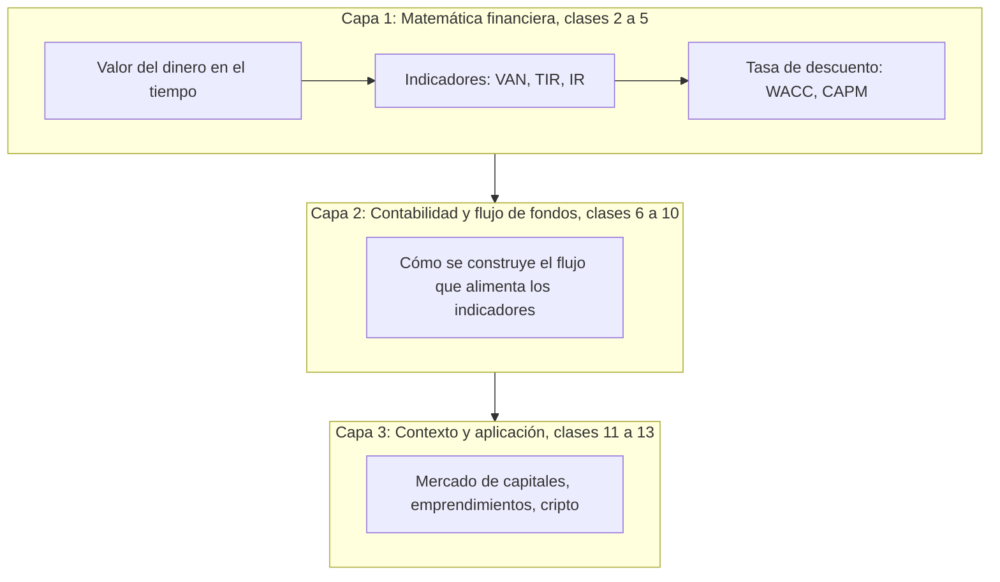

# Programa del curso

> [!abstract] En una frase
> **Evaluación de Proyectos de Tecnología** (código 3.4.139) enseña a decidir si un
> proyecto de IT conviene: primero la matemática financiera, después cómo se arma
> el flujo de fondos y, al final, el contexto de mercado.

**Datos:** FAIN, departamento DETIN, 68 horas. Año 2026, 2° cuatrimestre, lunes de
18:45 a 22:15 hs, 19 semanas. Docente: Helga Zambrana, MBA.

---

## Las tres capas del curso

1. **Matemática financiera** (clases 2 a 5): el valor del dinero en el tiempo, los
   indicadores y de dónde sale la tasa. Es todo el contenido cubierto hasta hoy en
   este vault.
2. **Contabilidad y flujo de fondos** (clases 6 a 10): cómo se construye en la
   práctica el flujo que alimenta esos indicadores.
3. **Contexto y aplicación** (clases 11 a 13): mercado de capitales,
   emprendimientos tecnológicos, dinero y criptomonedas.

---

## Cronograma clase por clase

| Clase | Fecha | Tema | Páginas |
|---|---|---|---|
| 1 | 03/08 | Introducción: técnicas de evaluación de proyectos de inversión en IT | [[tecnicas-de-evaluacion-de-proyectos]] |
| 2 | 10/08 | Matemática Financiera I | [[interes-simple]], [[interes-compuesto]], [[tasa-de-interes]], [[ecuacion-de-fisher]] |
| | 17/08 | Feriado | |
| 3 | 22/08 | Matemática Financiera I (remota sincrónica, 9 a 13 hs) | [[valor-tiempo-del-dinero]] |
| 4 | 24/08 | Matemática Financiera II | [[flujo-de-fondos]], [[valor-actual-neto]], [[tasa-interna-de-retorno]] |
| 5 | 31/08 | Matemática Financiera III | [[wacc]], [[capm]], [[tasa-de-descuento]] |
| 6 | 07/09 | Contabilidad tradicional | [[ecuacion-contable-fundamental]] |
| **7** | **14/09** | **1° Parcial** | [[parciales-y-practica]], [[repaso-primer-parcial]] |
| 8 | 21/09 | Flujo de Fondos I · Lanzamiento TPO | |
| 9 | 28/09 | Flujo de Fondos II | |
| 10 | 05/10 | Contabilidad de Gestión | |
| | 12/10 | Feriado · **13/10 (martes): Entrega Intermedia TPO** | |
| 11 | 19/10 | Finanzas y Mercado de Capitales | |
| 12 | 26/10 | Emprendimientos Tecnológicos | |
| 13 | 02/11 | Dinero y Criptomonedas · **05/11 (jueves): Entrega Final TPO** | |
| **14** | **09/11** | **2° Parcial** | |
| 15 | 16/11 | Repaso general · Defensa TPO grupos 1 a 4 | |
| | 23/11 | Feriado | |
| 16 | 30/11 | Repaso general · Defensa TPO grupos 5 a 8 | |
| 17 | 07/12 | **Recuperatorio / Final adelantado** | |
| | 21/12 | **Final regular** | |

> [!note] Régimen disciplinario
> Los actos de deshonestidad académica o cualquier situación de indisciplina se
> sancionan según el régimen disciplinario correspondiente.

## Relacionado

- [[parciales-y-practica]]: fechas de evaluación y qué entra en cada una.
- [[index]]: mapa de todas las páginas.
